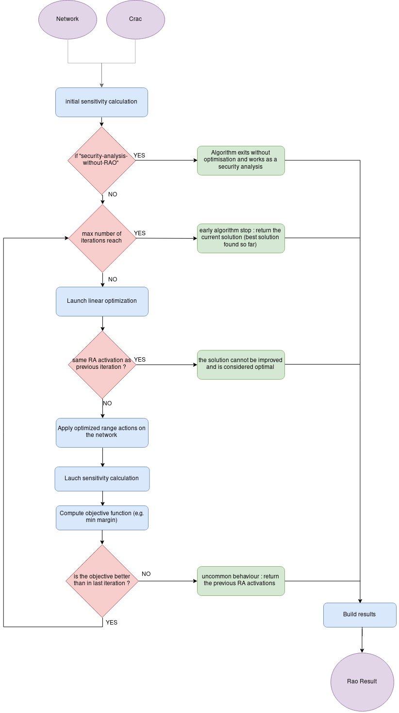

# Linear Remedial Actions Optimisation

```{toctree}
:hidden:
linear-problem/core-problem-filler.md
linear-problem/objective-function-types.md
linear-problem/special-features.md
linear-problem/time-coupled-constraints.md
linear-problem/continuous-range-action-group-filler.md
linear-problem/discrete-pst-tap-filler.md
linear-problem/discrete-pst-group-filler.md
linear-problem/ra-usage-limits-filler.md

```

## Introduction

The Linear RAO optimises the linear remedial actions (for now: PSTs, HVDCs, injection range actions) according to a 
configurable objective function (e.g. maximization of the minimum margin). The solving algorithm approximates the impact 
of the remedial actions on the network flows with linear sensitivity coefficients (hence the "**L**inear **R**emedial 
**A**ctions" name, or **LRA**s). 
It therefore solves linear optimisation problems to find the optimal set-points for the remedial actions. 
Moreover, it can iterate over several reference points in order to mitigate the linear approximation inherent to its optimisation problem.

In particular, the Linear RAO module is used in [CASTOR](../castor.md#castor-the-rao-algorithm)

## Inputs

The main inputs of the algorithm are:
- the network of the "initial situation", where the remedial actions are supposed to be at their "initial position",
- an extract of the original [CRAC](../../input-data/crac.md), containing only the range actions to be optimised.

## Outputs

The linear RAO result is provided, containing the optimal setpoints of the range actions.

## Algorithm

Let’s take the example of a PST to clarify how linear remedial actions are optimised.
PST optimisation relies on 3 types of computations:
- A sensitivity analysis, which answers the question: how much does each PST shift angle impact the flow on each CNEC?
These sensitivities (or Phase Shifter Distribution Factors, PSDF) are re-computed for each and every CNEC that are part of the studied perimeter, for each candidate RA during remedial action optimisation, and for each step of the optimisation.
- A linear optimisation: based on those sensitivities, what is the combination of phase shift angles which maximizes the objective function value?
- A standard security analysis, checks that the new PST taps actually improve the objective function value. Indeed, the linear optimisation remains an approximation (valid in DC), and transforming angles to discrete PST taps can also cause differences between the anticipated margins and the actual computed margin.

Hereunder, the specific workflow related to linear optimisation.



### Forcing set-points of a defined set of linear remedial actions to be equal

CASTOR can be configured to define groups of "aligned" LRAs whose taps should be maintained equal during optimisation. To see how this is done, you can check the details of the linear optimisation problem.

### Minimum impact of a LRA in the linear optimisation

In order to control the usage of LRAs in the optimisation, it is possible to set a constraint in the optimisation problem: the change in set-point value of one particular LRA should not have an impact on the objective function smaller than a configurable value (see [pst-sensitivity-threshold](../../parameters/implementation-specific-parameters.md#pst-sensitivity-threshold), [hvdc-sensitivity-threshold](../../parameters/implementation-specific-parameters.md#hvdc-sensitivity-threshold), and [injection-ra-sensitivity-threshold](../../parameters/implementation-specific-parameters.md#injection-ra-sensitivity-threshold)).

When computing the LRA sensitivities, only the ones which are higher than these parameters are considered and the others are considered zero. This allows us to filter out the PSTs which don't have a big enough impact on the CNECs.

Also, while solving the linear optimisation problem, the usage of LRAs is penalised. This is done by adding a configurable penalty cost for moving the set-points in the linear problem's objective function:

$$\begin{equation}
\max MM - \sum_{lra \in \mathcal{LRA}} \Delta_{lra} c^{LRA}
\end{equation}$$

with $MM$ the minimum margin, $\mathcal{LRA}$ the set of LRAs, $\Delta_{lra}$ the variation of setpoint of the LRA $lra$, and $c^{LRA}$ the penalty cost (see [pst-ra-min-impact-threshold](../../parameters/business-parameters.md#pst-ra-min-impact-threshold), [hvdc-ra-min-impact-threshold](../../parameters/business-parameters.md#hvdc-ra-min-impact-threshold), and [injection-ra-min-impact-threshold](../../parameters/business-parameters.md#injection-ra-min-impact-threshold)).

This way, if two solutions provide (almost) the same minimum margin, the problem will favor the one that changes the setpoints the 
least.
