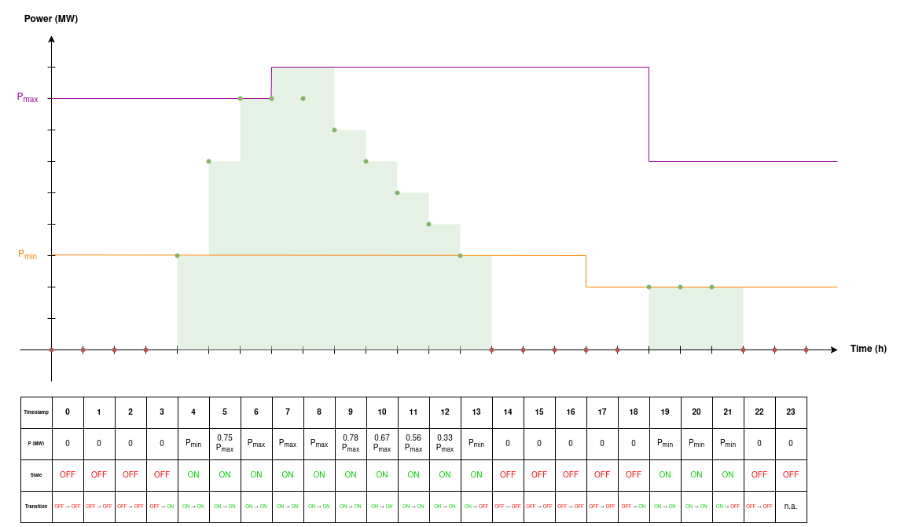

# Modeling the generator constraints

## Preliminary notations

A generator possesses mechanical characteristics that constrain the way it can be operated. Among these characteristics
are:

- the **minimum operating power** (or $P_{\min}$), which is the lowest power value the generator can reach when turned
  on operated;
- the **maximum operating power** (or $P_{\max}$), which is the highest power value the generator can reach at any time;
- the [**lead time**](../../../../input-data/specific-input-data/intertemporal-constraints.md#lead-time), which is the 
  time required by the generator to reach its $P_{\min}$ after it was ordered to start up;
- the [**lag time**](../../../../input-data/specific-input-data/intertemporal-constraints.md#lag-time), which is the
  time required by the generator to reach complete shutdown from its $P_{\min}$.

The generator then operates in two distinct states depending on its current power, based on the aforementioned
characteristics:

- it is **OFF** whenever its power is null;
- it is **ON** whenever its power is greater or equal than $P_{\min}$ (and lower or equal than $P_{\max}$).

{.forced-white-background}

## Hypotheses

To simplify the problem, we will consider that the orders to switch a generator ON or OFF are given at the beginning of
the timestamps, and not some time in between two timestamps.

## Used input data

> In the following we define as _grid state_ a network situation for a given instant after a given contingency or the
> basecase.

| Name                               | Symbol                      | Details                                                                                                                       |
|------------------------------------|-----------------------------|-------------------------------------------------------------------------------------------------------------------------------|
| Constrained generators set         | $\Gamma$                    | Set of generators with constraints defined                                                                                    |
| PMin                               | $P_{\min}(g, t)$            | Minimum operating power of generator $g$ at timestamp $t$. This value must be positive.                                       |
| PMax                               | $P_{\max}(g)$               | Maximum operating power of generator $g$. This value must be positive.                                                        |
| Lead Time                          | $LEAD(g)$                   | Time elapsed between the start-up order and the moment the generator power reaches $P_{\min}$.                                |
| Lag Time                           | $LAG(g)$                    | Time elapsed between the shut-down order and the moment the generator power reaches 0.                                        |
| Upward power gradient constraint   | $\nabla^{+}(g)$             | Maximum upward power variation between two consecutive timestamps for generator $g$. This value must be positive.             |
| Downward power gradient constraint | $\nabla^{-}(g)$             | Maximum downward power variation between two consecutive timestamps for generator $g$. This value must be negative.           |
| Off-power deadband                 | $\epsilon_{P}^{\text{OFF}}$ | Power deadband used to define the OFF state and account for rounding issues. This value must be positive.                     |
| Timestamps                         | $\mathcal{T}$               | Set of all timestamps on which the optimization is performed.                                                                 |
| Time gap                           | $\Delta_{\tau}$             | Time gap between two consecutive timestamps. It is assumed constant for all pairs of consecutive timestamps.                  |
| Generator states                   | $\Omega_{generator}$        | Set of all possible states a generator can be in: $\lbrace \textcolor{green}{\text{ON}}, \textcolor{red}{\text{OFF}} \rbrace$ |

## Defined optimization variables

| Name                       | Symbol                          | Details                                                                                                                                               | Type       | Index                                                                                                                                                                                              | Unit    | Lower bound | Upper bound |
|----------------------------|---------------------------------|-------------------------------------------------------------------------------------------------------------------------------------------------------|------------|----------------------------------------------------------------------------------------------------------------------------------------------------------------------------------------------------|---------|-------------|-------------|
| Generator power            | $P(g,s,t)$                      | the power of generator $g$ at grid state $s$ of timestamp $t$                                                                                         | Real value | one per generator defined in $\Gamma$, per grid state and per timestamp of $\mathcal{T}$                                                                                                           | MW      | 0           | $P_{\max}$  |
| Generator state            | $\delta_{\omega}^{gen}(g,s,t)$  | whether generator $g$'s state is $\omega$ at grid state $s$ of timestamp $t$ or not                                                                   | Binary     | one per generator defined in $\Gamma$, per generator state $\omega \in \Omega_{generator}$, per grid state and per timestamp of $\mathcal{T}$                                                      | No unit | 0           | 1           |
| Generator state transition | $T_{\omega \to \omega'}(g,s,t)$ | whether generator $g$'s state has transitioned from $\omega$ at timestamp $t$ to $\omega'$ at timestamp $t + \Delta_{\tau}$, at grid state $s$ or not | Binary     | one per generator defined in $\Gamma$, per generator state $\omega \in \Omega_{generator}$, per generator state $\omega' \in \Omega_{generator}$ per grid state and per timestamp of $\mathcal{T}$ | No unit | 0           | 1           |

## Used optimization variables

| Name                   | Symbol     | Defined in                                                                    |
|------------------------|------------|-------------------------------------------------------------------------------|
| Range action set-point | $A(r,s,t)$ | [CoreProblemFiller](../core-problem-filler.md#defined-optimization-variables) |

## Defined constraints

### Only one state

At each timestamp and for each grid state, each generator can only be in one of the two states between ON and OFF.
Mathematically, this is written as:

$$\forall g \in \Gamma, \forall t \in \mathcal{T}, \forall s, \; \delta_{\textcolor{green}{\text{ON}}}^{gen}(g,s,t) + \delta_{\textcolor{red}{\text{OFF}}}^{gen}(g,s,t) = 1$$

### On or Off State

By definition, the generator is ON if its power is greater than $P_{\min}$ and OFF if its power is null. To account for
issues that can stem from number rounding, we define a _minimal power variation deadband_ $\epsilon_{P}^{\text{OFF}}$
such that if the power of the generator is lower that $\epsilon_{P}^{\text{OFF}}$, the generator is considered OFF.

$$P_{\min}(g, t) \delta_{\textcolor{green}{\text{ON}}}^{gen}(g,s,t) \leq P(g,s,t) \leq P_{\max}(g) \delta_{\textcolor{green}{\text{ON}}}^{gen}(g,s,t) + \epsilon_{P}^{\text{OFF}} \delta_{\textcolor{red}{\text{OFF}}}^{gen}(g,s,t)$$

### State transition constraints

To ensure a continuity in the cycle of generator states, a _chaining_ needs to be set up thanks to linear constraints
linking the state variables of two consecutive timestamps to the transition variables. Thus,
$\forall g \in \Gamma, \forall t \in \mathcal{T}, \forall s$:

#### *State-From* constraints

The timestamp's state must be the starting state of the transition that occurred during the timestamp, no matter the
final state. Thus, $\forall g \in \Gamma, \forall t \in \mathcal{T}, \forall s$:

$$\delta_{\textcolor{red}{\text{OFF}}}^{gen}(g,s,t) = T_{\textcolor{red}{\text{OFF}} \to \textcolor{red}{\text{OFF}}}(g,s,t) + T_{\textcolor{red}{\text{OFF}} \to \textcolor{green}{\text{ON}}}(g,s,t)$$

$$\delta_{\textcolor{green}{\text{ON}}}^{gen}(g,s,t) = T_{\textcolor{green}{\text{ON}} \to \textcolor{green}{\text{ON}}}(g,s,t) + T_{\textcolor{green}{\text{ON}} \to \textcolor{red}{\text{OFF}}}(g,s,t)$$

#### *State-To* constraints

The next timestamp must be the final state of the transition that occurred during the timestamp, no matter the state of
origin. Thus, $\forall g \in \Gamma, \forall t \in \mathcal{T}, \forall s$:

$$\delta_{\textcolor{red}{\text{OFF}}}^{gen}(g,s,t + \Delta_{\tau}) = T_{\textcolor{red}{\text{OFF}} \to \textcolor{red}{\text{OFF}}}(g,s,t) + T_{\textcolor{green}{\text{ON}} \to \textcolor{red}{\text{OFF}}}(g,s,t)$$

$$\delta_{\textcolor{green}{\text{ON}}}^{gen}(g,s,t + \Delta_{\tau}) = T_{\textcolor{green}{\text{ON}} \to \textcolor{green}{\text{ON}}}(g,s,t) + T_{\textcolor{red}{\text{OFF}} \to \textcolor{green}{\text{ON}}}(g,s,t)$$

### Start-Up

When the generator is turned on, it has a warm-up time called _lead time_ during which the power remains null before it
steps up to $P_{\min}$.

$$\forall t' \in \left [ t + \Delta_{\tau} - \Delta_{\tau} \left \lceil \frac{LEAD(g)}{\Delta_{\tau}} \right \rceil, t \right ] \cap \mathcal{T}, \; T_{\textcolor{red}{\text{OFF}} \to \textcolor{green}{\text{ON}}}(g,s,t) \leq \delta_{\textcolor{red}{\text{OFF}}}^{gen}(g,s,t')$$

### Shut-Down

Similarly, when the generator is shut off, it has a cool-down time called _lag time_ during which the power remains
null and the generator cannot be turned on again.

$$\forall t' \in \left [ t + \Delta_{\tau}, t + \Delta_{\tau} \left \lceil \frac{LAG(g)}{\Delta_{\tau}} \right \rceil \right ] \cap \mathcal{T}, \; T_{\textcolor{green}{\text{ON}} \to \textcolor{red}{\text{OFF}}}(g,s,t) \leq \delta_{\textcolor{red}{\text{OFF}}}^{gen}(g,s,t')$$

### Power variation constraint

The power variation and the state transitions are strongly entangled and constrain one another. Depending on the state
transition, the power variation $P(g,s,t + \Delta_{\tau}  ) - P(g,s,t)$ is bounded differently.

#### OFF to OFF transition

$$- \epsilon_{P}^{\text{OFF}} T_{\textcolor{red}{\text{OFF}} \to \textcolor{red}{\text{OFF}}}(g,s,t) \leq P(g,s,t + \Delta_{\tau}) - P(g,s,t) \leq \epsilon_{P}^{\text{OFF}} T_{\textcolor{red}{\text{OFF}} \to \textcolor{red}{\text{OFF}}}(g,s,t)$$

#### OFF to ON transition

##### With lead time

With a lead time, the generator must first step up to $P_{\min}$ before to be operated between $P_{\min}$ and $P_{\max}$
under the power gradient constraints.

$$\left ( P_{\min}(g, t + \Delta_{\tau}) - \epsilon_{P}^{\text{OFF}} \right ) T_{\textcolor{red}{\text{OFF}} \to \textcolor{green}{\text{ON}}}(g,s,t) \leq P(g,s,t + \Delta_{\tau}) - P(g,s,t) \leq P_{\min}(g, t + \Delta_{\tau}) T_{\textcolor{red}{\text{OFF}} \to \textcolor{green}{\text{ON}}}(g,s,t)$$

##### Without lead time

$$\left ( P_{\min}(g, t + \Delta_{\tau}) - \epsilon_{P}^{\text{OFF}} \right ) T_{\textcolor{red}{\text{OFF}} \to \textcolor{green}{\text{ON}}}(g,s,t) \leq P(g,s,t + \Delta_{\tau}) - P(g,s,t) \leq \left ( P_{\min}(g, t + \Delta_{\tau}) + \nabla^{+}(g) \Delta_{\tau} \right ) T_{\textcolor{red}{\text{OFF}} \to \textcolor{green}{\text{ON}}}(g,s,t)$$

#### ON to ON transition

$$\nabla^{-}(g) \Delta_{\tau} T_{\textcolor{green}{\text{ON}} \to \textcolor{green}{\text{ON}}}(g,s,t) \leq P(g,s,t + \Delta_{\tau}) - P(g,s,t) \leq \nabla^{+}(g) \Delta_{\tau} T_{\textcolor{green}{\text{ON}} \to \textcolor{green}{\text{ON}}}(g,s,t)$$

#### ON to OFF transition

##### With lag time

With a lag time, the generator must step down from $P_{\min}$ to 0 instead of being shut down from any power value above
$P_{\min}$.

$$- P_{\min}(g, t) T_{\textcolor{green}{\text{ON}} \to \textcolor{red}{\text{OFF}}}(g,s,t) \leq P(g,s,t + \Delta_{\tau}) - P(g,s,t) \leq - \left ( P_{\min}(g, t) - \epsilon_{P}^{\text{OFF}} \right ) T_{\textcolor{green}{\text{ON}} \to \textcolor{red}{\text{OFF}}}(g,s,t)$$

##### Without lag time

$$- \left ( P_{\min}(g, t) - \nabla^{-}(g) \Delta_{\tau} \right) T_{\textcolor{green}{\text{ON}} \to \textcolor{red}{\text{OFF}}}(g,s,t) \leq P(g,s,t + \Delta_{\tau}) - P(g,s,t) \leq - \left ( P_{\min}(g, t) - \epsilon_{P}^{\text{OFF}} \right ) T_{\textcolor{green}{\text{ON}} \to \textcolor{red}{\text{OFF}}}(g,s,t)$$

### Injection to generator power constraint

The power of the generator can be linked to the set-point of the injection range action $r$ it is involved in:

$$P(g,s,t) = k(g,r) A(r,s,t)$$

where $k(g,r)$ is the injection key of $g$ in $r$.
