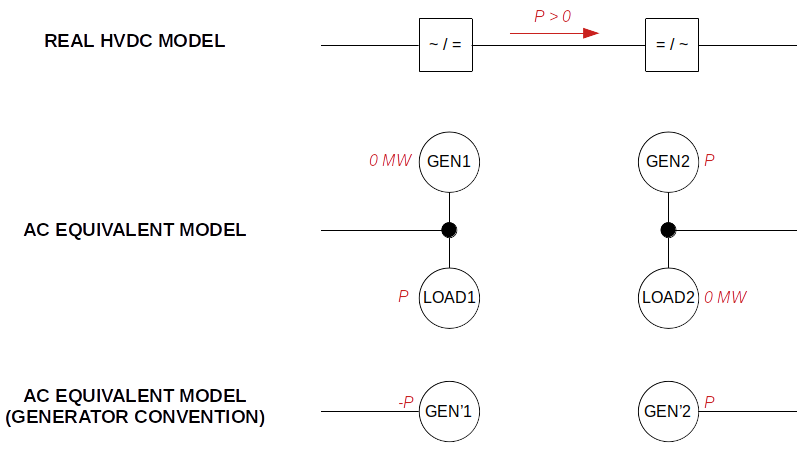

# HVDC

## Definition

HVDC lines are modeled using [HvdcLine of the IIDM PowSyBl network model](inv:powsyblcore:*:*#hvdc-line), and an HVDC Range Action will always point to an HVDC line.

An HVDC line can operate in **two modes**:

1. **Fixed Setpoint Mode**  
   In this mode, the power flow on the HVDC line is directly controlled via its **active power setpoint**.

2. **AC Emulation Mode**  
   The HVDC line operates in AC Emulation mode when the extension [**angle-droop active power control**](inv:powsyblecore:*:*#hvdc-angle-droop-active-power-control-extension) is enabled. In this mode, the flow is determined by the **phase difference**:  
  
  $$ P = P_0 \cdot k (\phi_1 - \phi_2)$$
   and **ignores the active power setpoint**.

**Implication:**

- An HVDC range action moves the active setpoint field of the HVDC line. When a line is in AC Emulation mode, applying an **HVDC range action** has no effect because the line cannot be directly controlled via its active power setpoint.  
In order to use and optimize the setpoint of an HVDC range action, the HVDC line associated needs to be switched to fix setpoint mode before hand more info on that following sections.

- For the same reason, attempting to define a sensitivity for an HVDC range action with a line still in AC emulation will result in an **OLF error**. See [Open Load Flow documentation](https://powsybl.readthedocs.io/projects/powsybl-open-loadflow/en/latest/sensitivity/getting_started.html).

---

## HVDC Range Action in some capacity calculation processes

### Italy Nord Process (CSE CRAC)

As HVDC line cannot be modeled in UCTE format, an equivalent model is used: the HVDC is represented through two injections (one on each side of the line, with opposite keys of 1 and -1) as illustrated in the following diagram.

{.forced-white-background}

By doing this, the HVDC line is **always considered in fixed setpoint mode**.

For more information on how HVDC range actions are handled, see [Gridcapa IN Process](https://gridcapa.github.io/docs/process-documentation/in-cc/import-ec/process-description#pisa-hvdc-alignment).  
For details on how they are defined in CRAC, see [CSE CRAC documentation](../../../input-data/crac/cse.md#hvdc-range-actions).

> ✅ All issues related to AC Emulation do not affect this process, as there is no HVDC line element in the network

### SWE Process (CIM CRAC)

In this process, contrary to previous modelization, HVDC lines are represented in the [CGMES](https://powsybl.readthedocs.io/projects/powsybl-core/en/latest/grid_exchange_formats/cgmes/index.html) network, thus HVDC range actions are linked to a real HVDC line element. 
HVDC range actions are typically handled in **groups of two aligned actions**.  
Aligned HVDC range actions share the same **group ID**, meaning they must have the same setpoint.

For details on their definition in CRAC, see [CIM CRAC documentation](../../../input-data/crac/cim.md#hvdc-range-actions).  
Currently, this range action is only imported in **auto instant**.

---

## HVDC in Castor, the RAO Algorithm

We now support the optimization of HVDC range actions in **preventive**, **auto** and **curative** instants.

### Managing HVDC Setpoints to Avoid Network Imbalance

> ⚠️ **Warning**
>
> In the initial network, if the HVDC line is in **AC Emulation mode**, its active power setpoint will likely be random, as it does not affect network balance.
>
> When AC Emulation is **deactivated**, the HVDC line follows its active power setpoint. If this setpoint is extreme or unrealistic, it can **unbalance the network**, potentially causing **sensitivity calculations to fail to converge**.

To prevent network imbalance when deactivating AC Emulation, follow this **HVDC Setpoint Initialization** procedure:

1. Run a **Load Flow** with the HVDC line in AC Emulation mode.
2. Record the **power flow** on the HVDC line from the network.
3. Deactivate AC Emulation.
4. Set the **active power setpoint** of the HVDC line to the previously recorded flow.

> ⚡ **Note:** This issue only arises if a sensitivity calculation is required immediately after AC emulation deactivation, before updating the HVDC line active power setpoint.

### Pre-Treatment

#### Creating `acEmulationDeactivationAction`

If an HVDC Range Action uses a line in AC Emulation mode, a corresponding network action called [**acEmulationDeactivationAction**](../../../input-data/crac/json.md#network-actions) with the same usage rule is created. Only one **acEmulationDeactivationAction** is created per HVDC line.

This network action allows the RAO to identify the optimal solution between:

1. Keeping the HVDC line in AC Emulation mode, or
2. Switching to fixed setpoint mode and optimizing the setpoint via the MIP.

#### HVDC Range Action Initially in AC Emulation — Initial Setpoint

At the very beginning of the RAO, a **load flow** is run to update the **initial setpoint** of HVDC range actions starting in AC Emulation mode.  
Since the initial setpoint is now read from the network during CRAC deserialization, this step ensures a **meaningful and realistic initial setpoint**.

### HVDC Range Action Optimization in Preventive and Curative Instants

1. At the root of each search tree (preventive or curative), a **load flow** is run.
2. For a given leaf, if an **acEmulationDeactivationAction** is applied, the HVDC line's **active setpoint** is updated in the network.
3. The **HVDC Range Action** is available in the MIP only if the HVDC line is *not* in AC Emulation mode; otherwise, it is **filtered out before each MIP**.

### HVDC Range Action in Auto Instant

Unlike other network actions, the **acEmulationDeactivationAction** is **not automatically applied**.  
AC Emulation is deactivated only if optimization or use of the HVDC range action is required for automaton perimeter security.

After updating the setpoint, a **sensitivity calculation** is run, and the HVDC range action is optimized like any other range action. See [Castor documentation](../../castor.md).

---

## Additional Warnings

- **Terminology:** An HVDC line can be in AC Emulation mode even if the load flow is run in DC mode; these concepts are independent.
- Loadflow parameter **`hvdcAcEmulation`:** This should, in theory, always be `true`, if set to `false` all the HVDC line angle-droop active power control extension are ignored and all the line are considered in fixed setpoint mode. See [PowSyBl Core documentation](https://powsybl.readthedocs.io/projects/powsybl-core/en/stable/simulation/loadflow/configuration.html).  
