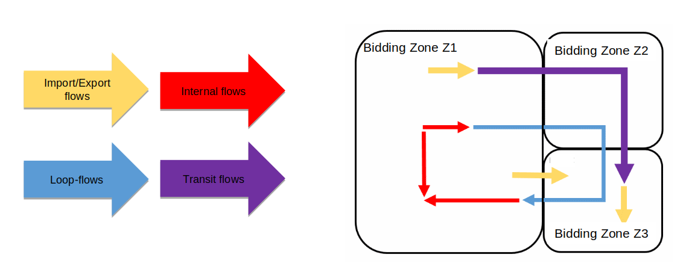

# Loop-flows

## Definition

When the power flows from the production areas to the consumers, the current physically takes several paths. The flow can be composed of:

- When production and consumers are in the same bidding zone Z:
  - **internal flows**: the current travels through lines that are in Z
  - **loop-flows**: the current travels through lines that are in several bidding zones

- When production and consumers are in different bidding zones Z1 and Z2:
  - **import/export flows**: the current only travels through lines that are in Z1 or Z2
  - **transit flows**: the current travels through lines that are in at least 3 different bidding zones

Therefore, loop-flows are the flows remaining on cross-border 
lines when no commercial exchanges are present. Loop-flows limit the capacity available for the market.

## Computation

> 💡 Loop-flows computation is now available in MEGAWATT or in AMPERE

It is possible to configure the RAO in order to make sure that, during RA optimisation, the loop-flow $F_{loop-flow}$
on each cross zonal CNEC does not exceed the maximum between:

- the initial loop-flow $F_0$
- the loop-flow threshold $ F_{max_{loop-flow}} $, provided by TSOs for each of their cross-zonal CNECs

It can be computed using the actual flow and the commercial flow:

$$\begin{equation}
F_{loop-flow}(c) = F(c) - F_{commercial}(c)
\end{equation}$$

$$\begin{equation}
F_{commercial} (c) = \sum_{z \in LFC} PTDF(c,z) * NP(z)
\end{equation}$$

With:
- LFC, the set of bidding zones for which we compute the commercial flows, set under [loop-flow-countries](../../../parameters/business-parameters.md#countries)
- NP, the net position of the bidding zone z, read from the [ReferenceProgram](../../../input-data/specific-input-data/reference-program.md)
- PTDF, the power transfer distribution factor of the bidding zone z on the FlowCnec c, eventually recomputed within the RAO depending on the value of the configuration parameter [loop-flow-approximation](../../../parameters/implementation-specific-parameters.md#ptdf-approximation).
The PTDF represents FlowCnec c's sensitivity to a variation of the net position on the bidding zone Z mapped on the network according to [GLSK](../../../input-data/glsk.md)).

## Implementation

Loop-flow limitation are modelled in the RAO under the linear problem as constraints for each CNEC $i$ forcing the loop-flows within their bounds, see [Loop-flow constraints](../linear-problem/special-features/max-loop-flow-filler.md).