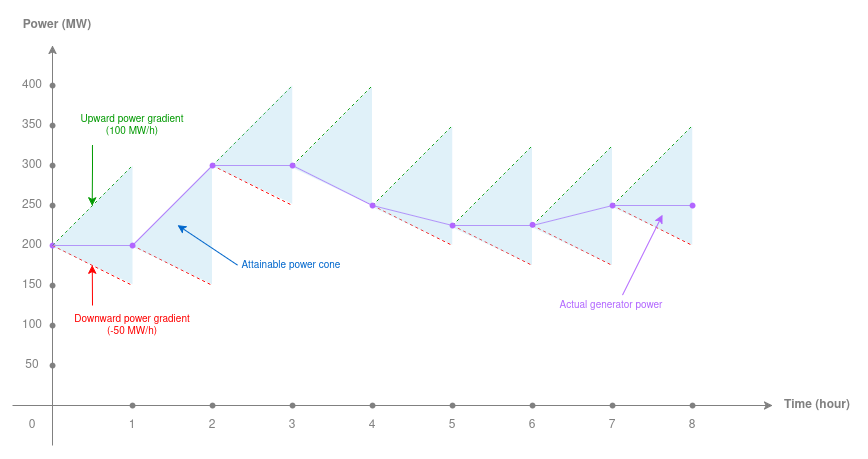
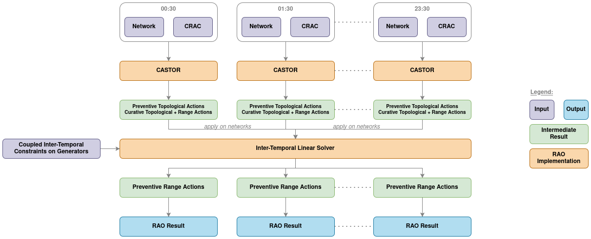

# MARMOT, the intertemporal RAO

MARMOT is another RAO implementation provided by PowSyBl OpenRAO that was specifically tailored to handle
**intertemporal constraints** that can exist on generators.

## General presentation

Optimizing remedial actions over several timestamps in a same day is a problem that is already addressed by TSOs in
various live processes all over Europe, and OpenRAO is used in many of them. However, the underlying assumption that was
chosen for simplicity's sake is that all these timestamps are independent, meaning that the decisions taken at a given
hour do not affect the others.

Though this simplification is very practical for performance reasons, it overshadows more realistic physical constraints
that are at stake in power grids. Indeed, generators must be operated under certain conditions to respect mechanical
constraints that restrict the range of power they can deliver over a bounded period of time. Among these constraints are
**power gradient constraints** (in MW/h for instance) that restrict the power variation of a generator over time.

When aiming for a more realistic modelling of the power grid, such constraints must be taken in account and some RCCs
have already expressed their need for including intertemporal constraints in RAO optimization.

By coupling the optimization timestamps with one another, these intertemporal constraints increase significantly the
combinatorics' complexity behind the mathematical problem tackled by the RAO. New technical solutions and new resolution
paradigms must be developed to address this _enhanced_ problem formulation, and this is why MARMOT was implemented.

## Optimization workflow

With a sensitivity-based model relying on a linear superposition principle, it is possible to optimize all range actions
at once for various correlated network states. This is already carried out during the
[second preventive optimization](castor/rao-steps.md#second-preventive-rao) in CASTOR when preventive and curative range
actions are all optimized, even if some of them are defined on the same network element. In this case, states are
coupled by _causality_ in the sense that preventive choices affect the following curative states.

This model can be enhanced with a new temporal dimension to account for the different timestamps that are being
optimized at once. Here, what couple the states are the intertemporal power gradient constraints of generators that
restrict the variation of generators' set-points over time based on the duration of the timestamps.

The whole complexity of the intertemporal optimization hides in the handling of topological action, since their
non-linear behavior prevents them from being optimized at the same time and _as easily_ as range actions. Besides, the
[search-tree algorithm](castor.md#search-tree-algorithm) used in CASTOR does not fit well to this problem because the
topological actions combinations it must assess now span over several timestamps, making their number skyrocket beyond
reasonable computation times.

The heuristic behind MARMOT is to tackle topological actions at first and then to focus on range actions that are easier
to deal with. The idea is thus to first run RAOs in parallel to optimize all the timestamps as if they were independent.
This allows MARMOT to find combinations of preventive and curative topological actions for all timestamps with a
strategy which is way more efficient that if they were tried at random.

When the topological actions for all timestamps are retrieved, they are applied on their respective network and a
**global intertemporal linear optimization** is carried out to fine-tune the set-points of all linear actions (PSTs,
injections, redispatching, ...) and smooth them out over time such that they respect the provided intertemporal
constraints.

> If no intertemporal constraints are provided or if they are all respected at the end of the independent RAOs, there is
> no need for the global linear RAO.

## Technical challenges

<!-- TODO: properly write the ideas below -->

- memory -> use path to files instead of networks
- overflows
- problem size

## Limitations

Currently, MARMOT only supports power gradient constraints but new intertemporal constraints like minimum/maximum up/off
times will be added in the future. Besides, the global linear problem can only optimize preventive range actions but
curative actions for non-redispatching actions will be included soon.