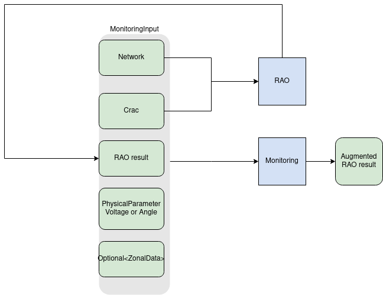
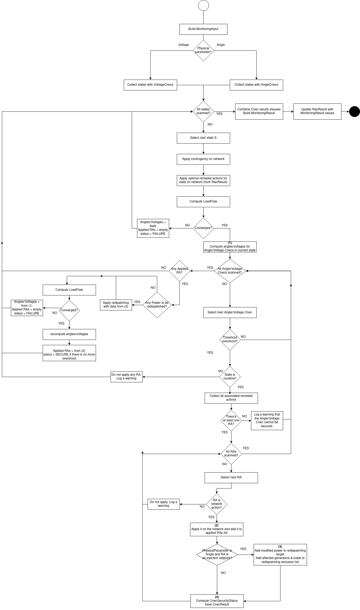

# Monitoring

OpenRAO has a monitoring module that can be used apart from the RAO to monitor Angles and/or Voltages:

## Introduction

In the [OpenRAO CRAC](../input-data/crac/json.md), the user can define angle or/and voltage constraints on network elements.  
These are constraints that ensure that the angle/voltage values on given network elements do not exceed a given threshold.  
OpenRAO allows modelling these constraints in [VoltageCnec](../input-data/crac/json.md#voltage-cnecs) and [AngleCnec](../input-data/crac/json.md#angle-cnecs) objects.  
However, modelling the impact of remedial actions on angle/voltage values is highly complex and non-linear. This is why CASTOR
does not inherently support  angle/voltage constraints.  
The [Monitoring](https://github.com/powsybl/powsybl-open-rao/tree/main/monitoring)
package allows monitoring angle/voltage values after a RAO has been run.

{.forced-white-background}

## The Java API

You can easily call the monitoring module using the [JAVA API](https://github.com/powsybl/powsybl-open-rao/blob/main/monitoring/src/main/java/com/powsybl/openrao/monitoring/Monitoring.java):
1. Build a MonitoringInput object using the MonitoringInputBuilder:

For angle monitoring :
~~~java
MonitoringInput<AngleCnec> monitoringInput = new AngleMonitoringInput(crac, network, raoResult, scalableZonalData);
~~~

For voltage monitoring :
~~~java
MonitoringInput<VoltageCnec> monitoringInput = new VoltageMonitoringInput(crac, network, raoResult);
~~~

With:
- crac: the CRAC object used for the RAO, and containing [VoltageCnecs](../input-data/crac/json.md#voltage-cnecs)/ [AngleCnecs](../input-data/crac/json.md#angle-cnecs) to be monitored.
- network: the network to be monitored.
- raoResult: the [RaoResult](../output-data/rao-result.md) object containing selected remedial actions (that shall
  be applied on the network before monitoring angle/voltage values)
- scalableZonalData for redispatching in case of angle monitoring

2. Run the monitoring algorithm using the constructed object's following method defined for both `AngleMonitoring` and `VoltageMonitoring`:

~~~java
public RaoResult runAndUpdateRaoResult(String loadFlowProvider, LoadFlowParameters loadFlowParameters, int numberOfLoadFlowsInParallel, monitoringInput)

~~~
With:
- loadFlowProvider: the name of the load-flow computer to use. This should refer to a [PowSyBl load flow provider implementation](https://powsybl.readthedocs.io/projects/pypowsybl/en/latest/user_guide/loadflow.html#providers)
- loadFlowParameters: the PowSyBl LoadFlowParameters object to configure load-flow computation.
- numberOfLoadFlowsInParallel: the number of contingencies to monitor in parallel, allowing a maximum utilization of
  your computing resources (set it to your number of available CPUs).
- monitoringInput as built above in step 1.

Here is a complete example while augmenting rao result by voltage monitoring result then augmenting the outcome by angle monitoring result:

~~~java
Crac crac = ...
Network network = ...
RaoResult raoResult = Rao.find(...).run(...)
LoadFlowParameters loadFlowParameters = ..
    
MonitoringInput voltageMonitoringInput = new MonitoringInput(crac, network, raoResult);
RaoResult raoResultWithVoltageMonitoring = VoltageMonitoring.runAndUpdateRaoResult("OpenLoadFlow", loadFlowParameters, 2, voltageMonitoringInput);

MonitoringInput angleMonitoringInput = new MonitoringInput(crac, network, raoResult, scalableZonalData);
RaoResult raoResultWithVoltageAndAngleMonitoring = AngleMonitoring.runAndUpdateRaoResult("OpenLoadFlow", loadFlowParameters, 2, angleMonitoringInput);
~~~

## The monitoring result

The method presented above generates a new [RAO result](../output-data/rao-result.md)
object, which is equivalent to the initial one, augmented by the relevant results of the angle monitoring or voltage monitoring :
- The [computation status](../output-data/rao-result.md#computation-status) of the RAO is updated
- The [activated network actions](../output-data/rao-result.md#network-actions-results) are updated
- The [angle](../output-data/rao-result.md#angle) & [margin](../output-data/rao-result.md#id3) values for angle CNECs are updated in case of angle monitoring
- The [voltage](../output-data/rao-result.md#voltage) & [margin](../output-data/rao-result.md#id3) values for voltage CNECs are updated in case of voltage monitoring

## The monitoring algorithm

Here is a detailed description of how the monitoring algorithm operates:
- Apply optimal preventive remedial actions from RaoResult on the network
- From the CRAC, get the set of states on which AngleCnecs/VoltageCnecs exist
- For each of these states, monitor angles/voltages:
    - Use a new copy of the network
    - If the state is not preventive,
        - apply the contingency on the network
        - from the RaoResult, apply on the network the optimal remedial actions decided by the RAO (automatic and curative)
    - Compute load-flow
        - If it diverges, return the following content for this state, then move on to the next state:
            - If PhysicalParameter is ANGLE : the angles of the angle CNECs equal to NaN
            - If PhysicalParameter is Voltage : the max and min values of the voltage CNECs equal to NaN
            - no applied remedial actions
            - status FAILURE
    - Compute the angles/voltages for all angle/voltage CNECs **(1)** :
        - If PhysicalParameter is ANGLE: angle values are the maximum phase difference between the 2 voltage levels
          Angle in degrees = 180 / pi * (max(angle on buses of exporting voltage level) - min(angle on buses of importing voltage level))
        - If PhysicalParameter is VOLTAGE: voltage values are the min and max voltages on the voltage level buses
    - Compare the angles/voltages to their thresholds.
    - Compute and save each cnec security status (SECURE, HIGH_CONSTRAINT, LOW_CONSTRAINT, HIGH_AND_LOW_CONSTRAINTS, FAILURE) depending on the position of the angle/voltage value(s) regarding the Angle/Voltage Thresholds
    - For the Angle/Voltage Cnecs that have an angle/voltage overshoot (negative margin), get the associated remedial actions
        - If the Angle/Voltage Cnec has no associated RA, then the constraint cannot be remedied: move on to the next Angle/Voltage Cnec.
        - If the state is preventive, do not apply any PRA (it would be incoherent with the RAO results). Move on to the next state.
        - For every RA:
            - If the remedial action is not a network action, do not apply it (if it's a RangeAction, we cannot know which set-point to use). Move on to the next RA.
            - If the RA is a network action, apply it on the network **(2)**.
    - If  PhysicalParameter is ANGLE and there is any injection-set-point RA applied, create and apply the re-dispatch that shall compensate the loss of generation / load **(3)**:
        - The amount of power to re-dispatch is the net sum (generation - load) of power generations & loads affected by the RAs, before changing the set-points
        - Exclude from the re-dispatching all the generators & loads that were modified by an injection-set-point RA, since they should not be affected
    - If no RA was applied, keep Cnec results from **(4)** and move on to the next state
    - If any RA was applied, recompute the load-flow
        - If it diverges, return the following content for this state, then move on to the next state:
            - the angles of the Angle/Voltage Cnecs equal to what was computed in step **(1)**
            - no applied remedial actions
            - security FAILURE
        - If it converges Re-compute all angle/voltage values and create a Cnec result, with updated angles/voltages, list of applied remedial actions in **(2)**, and new cnec status after comparing the new angle/voltage value(s) to their thresholds
- Assemble all the Angle/Voltage Cnec results in one overall result

{.forced-white-background}

## The output logs

In the logs, the start and end of different steps are logged:
- Start and end of the 'angle/voltage' monitoring algorithm
- Start and end of the monitoring of each state (preventive or post-contingency)
- Start and end of each load-flow computation

Also, the following information is logged:
- Applied remedial actions to relieve 'angle/voltage' constraints
- At the end of each state monitoring, the list of remaining 'angle/voltage' constraints
- At the end of the monitoring algorithm, the list of remaining 'angle/voltage constraints

**Example 1 - ANGLE Monitoring:**  
In this example, a curative constraint (after contingency "Co-1") induces the implementation of a CRA, but this CRA is
not enough to solve the constraint.
~~~
INFO  c.p.o.commons.logs.RaoBusinessLogs - ----- ANGLE monitoring [start]
INFO  c.p.o.commons.logs.TechnicalLogs - Using base network 'urn:uuid:4f4a3f29-6892-49ea-bfc1-92051973c799+urn:uuid:9e7050a8-960b-4e1a-8e34-7f56bc2b2a7b' on variant 'InitialState'
INFO  c.p.o.commons.logs.RaoBusinessLogs - -- 'ANGLE' Monitoring at state 'Co-1 - curative' [start]
INFO  c.p.o.commons.logs.TechnicalLogs - Load-flow computation [start]
INFO  c.p.o.commons.logs.TechnicalLogs - Load-flow computation [end]
INFO  c.p.o.commons.logs.RaoBusinessLogs - Applied the following remedial action(s) in order to reduce constraints on CNEC "AngleCnec1": RA-1
INFO  c.p.o.commons.logs.RaoBusinessLogs - Redispatching 108.0 MW in BE [start]
WARN  c.p.o.commons.logs.RaoBusinessWarns - Redispatching failed: asked=108.0 MW, applied=0.0 MW
INFO  c.p.o.commons.logs.RaoBusinessLogs - Redispatching 108.0 MW in BE [end]
INFO  c.p.o.commons.logs.RaoBusinessLogs - Redispatching 150.0 MW in NL [start]
INFO  c.p.o.commons.logs.RaoBusinessLogs - Redispatching 150.0 MW in NL [end]
INFO  c.p.o.commons.logs.TechnicalLogs - Load-flow computation [start]
INFO  c.p.o.commons.logs.TechnicalLogs - Load-flow computation [end]
INFO  c.p.o.commons.logs.RaoBusinessLogs - -- 'ANGLE' Monitoring at state 'Co-1 - curative' [end]
INFO  c.p.o.commons.logs.RaoBusinessLogs - Some ANGLE Cnecs are not secure:
INFO  c.p.o.commons.logs.RaoBusinessLogs - AngleCnec AngleCnec1 (with importing network element _d77b61ef-61aa-4b22-95f6-b56ca080788d and exporting network element _8d8a82ba-b5b0-4e94-861a-192af055f2b8) at state Co-1 - curative has an angle of 5°.
INFO  c.p.o.commons.logs.RaoBusinessLogs - -- 'ANGLE' Monitoring at state 'Co-2 - curative' [start]
INFO  c.p.o.commons.logs.TechnicalLogs - Load-flow computation [start]
INFO  c.p.o.commons.logs.TechnicalLogs - Load-flow computation [end]
INFO  c.p.o.commons.logs.RaoBusinessLogs - -- 'ANGLE' Monitoring at state 'Co-2 - curative' [end]
INFO  c.p.o.commons.logs.RaoBusinessLogs - All ANGLE Cnecs are secure.
INFO  c.p.o.commons.logs.RaoBusinessLogs - ----- ANGLE monitoring [end]
INFO  c.p.o.commons.logs.RaoBusinessLogs - Some ANGLE Cnecs are not secure:
INFO  c.p.o.commons.logs.RaoBusinessLogs - AngleCnec AngleCnec1 (with importing network element _d77b61ef-61aa-4b22-95f6-b56ca080788d and exporting network element _8d8a82ba-b5b0-4e94-861a-192af055f2b8) at state Co-1 - curative has an angle of 5°.

~~~

**Example 2 - VOLTAGE Monitoring:**  
In this example, a constraint exists in preventive (it cannot be solved because OpenRAO cannot implement PRAs to solve
voltage constraints), and another one in curative (but implementing the CRA does not solve it).
~~~
INFO  c.p.o.commons.logs.RaoBusinessLogs - ----- VOLTAGE monitoring [start]
INFO  c.p.o.commons.logs.RaoBusinessLogs - -- 'VOLTAGE' Monitoring at state 'preventive' [start]
INFO  c.p.o.commons.logs.TechnicalLogs - Load-flow computation [start]
INFO  c.p.o.commons.logs.TechnicalLogs - Load-flow computation [end]
WARN  c.p.o.commons.logs.RaoBusinessWarns - VOLTAGE Cnec vcPrev is constrained in preventive state, it cannot be secured.
INFO  c.p.o.commons.logs.RaoBusinessLogs - -- 'VOLTAGE' Monitoring at state 'preventive' [end]
INFO  c.p.o.commons.logs.RaoBusinessLogs - Some VOLTAGE Cnecs are not secure:
INFO  c.p.o.commons.logs.RaoBusinessLogs - Network element VL1 at state preventive has a min voltage of 400 kV and a max voltage of 400 kV.
INFO  c.p.o.commons.logs.TechnicalLogs - Using base network 'phaseShifter' on variant 'InitialState'
INFO  c.p.o.commons.logs.RaoBusinessLogs - -- 'VOLTAGE' Monitoring at state 'co - curative' [start]
INFO  c.p.o.commons.logs.TechnicalLogs - Load-flow computation [start]
INFO  c.p.o.commons.logs.TechnicalLogs - Load-flow computation [end]
INFO  c.p.o.commons.logs.RaoBusinessLogs - Applied the following remedial action(s) in order to reduce constraints on CNEC "vc": Open L1 - 2
INFO  c.p.o.commons.logs.TechnicalLogs - Load-flow computation [start]
INFO  c.p.o.commons.logs.TechnicalLogs - Load-flow computation [end]
INFO  c.p.o.commons.logs.RaoBusinessLogs - -- 'VOLTAGE' Monitoring at state 'co - curative' [end]
INFO  c.p.o.commons.logs.RaoBusinessLogs - Some VOLTAGE Cnecs are not secure:
INFO  c.p.o.commons.logs.RaoBusinessLogs - Network element VL1 at state co - curative has a min voltage of 400 kV and a max voltage of 400 kV.
INFO  c.p.o.commons.logs.RaoBusinessLogs - ----- VOLTAGE monitoring [end]
INFO  c.p.o.commons.logs.RaoBusinessLogs - Some VOLTAGE Cnecs are not secure:
INFO  c.p.o.commons.logs.RaoBusinessLogs - Network element VL1 at state co - curative has a min voltage of 400 kV and a max voltage of 400 kV.
INFO  c.p.o.commons.logs.RaoBusinessLogs - Network element VL1 at state preventive has a min voltage of 400 kV and a max voltage of 400 kV.
~~~

**Example 3 - VOLTAGE Monitoring:**  
In this example, a curative constraint (after contingency "co") is solved by a CRA.
~~~
INFO  c.p.o.commons.logs.RaoBusinessLogs - ----- VOLTAGE monitoring [start]
INFO  c.p.o.commons.logs.TechnicalLogs - Using base network 'phaseShifter' on variant 'InitialState'
INFO  c.p.o.commons.logs.RaoBusinessLogs - -- 'VOLTAGE' Monitoring at state 'co - curative' [start]
INFO  c.p.o.commons.logs.TechnicalLogs - Load-flow computation [start]
INFO  c.p.o.commons.logs.TechnicalLogs - Load-flow computation [end]
INFO  c.p.o.commons.logs.RaoBusinessLogs - Applied the following remedial action(s) in order to reduce constraints on CNEC "vc": Close L1 - 1
INFO  c.p.o.commons.logs.TechnicalLogs - Load-flow computation [start]
INFO  c.p.o.commons.logs.TechnicalLogs - Load-flow computation [end]
INFO  c.p.o.commons.logs.RaoBusinessLogs - -- 'VOLTAGE' Monitoring at state 'co - curative' [end]
INFO  c.p.o.commons.logs.RaoBusinessLogs - All VOLTAGE Cnecs are secure.
INFO  c.p.o.commons.logs.RaoBusinessLogs - ----- VOLTAGE monitoring [end]
INFO  c.p.o.commons.logs.RaoBusinessLogs - All VOLTAGE Cnecs are secure.
~~~