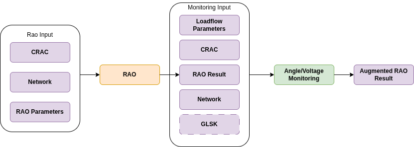

# Getting started

## Introduction

In the [OpenRAO JSON CRAC](../../input-data/crac/json.md), the user can define angle or/and voltage constraints on network elements.  
These are constraints that ensure that the angle/voltage values on the given network elements do not exceed a given threshold. 

However, modelling the impact of remedial actions on angle/voltage values is highly complex and non-linear. This is why CASTOR
does not inherently support angle/voltage constraints.  

The [Monitoring](https://github.com/powsybl/powsybl-open-rao/tree/main/monitoring) module allows monitoring angle/voltage values **after a RAO has been run.**

{.forced-white-background}

## Table of contents
- [Monitoring input](#monitoring-input)
- [Monitoring result](#monitoring-result)
- [Java example](#java-example)
- [Python example](#python-example)
- [How to read the output logs](#how-to-read-the-output-logs)

## Monitoring input

- The [CRAC](../../input-data/crac/json.md) object used for the RAO, and containing [VoltageCnecs](../../input-data/crac/json.md#voltage-cnecs)/ [AngleCnecs](../../input-data/crac/json.md#angle-cnecs) to be monitored.
- The [network](../../input-data/network.md) to be monitored.
- The [loadflow parameters](https://powsybl.readthedocs.io/projects/powsybl-open-loadflow/en/latest/loadflow/parameters.html) used for the load-flow computation.
- The [RaoResult](../../output-data/rao-result.md) object containing selected remedial actions (that shall
  be applied on the network before monitoring angle/voltage values)
- Optional: [GSLK file](https://powsybl.readthedocs.io/projects/entsoe/en/latest/glsk/glsk.html) for redispatching in case of **angle monitoring**

## Monitoring result

The method presented above generates a new [RaoResult](../../output-data/rao-result.md)
object, which is equivalent to the initial one, augmented by the relevant results of the angle monitoring or voltage monitoring :
- The [computation status](../../output-data/rao-result.md#computation-status) of the RAO is updated
- The [activated network actions](../../output-data/rao-result.md#network-actions-results) are updated
- The [angle](../../output-data/rao-result.md#angle) & [margin](../../output-data/rao-result.md#margin-1) values for angle CNECs are updated in case of angle monitoring
- The [voltage](../../output-data/rao-result.md#voltage) & [margin](../../output-data/rao-result.md#margin-2) values for voltage CNECs are updated in case of voltage monitoring

> See [angle CNECs results](../../output-data/rao-result.md#angle-cnecs-results) and [voltage CNECs results](../../output-data/rao-result.md#voltage-cnecs-results) sections of the RaoResult documentation for more details.

## Java example

~~~java
// Prepare the RAO input
Network network = Network.read("path/to/networkfile");
Crac crac = Crac.read("path/to/cracfile", new FileInputStream("path/to/cracfile"), network);
RaoParameters raoParameters = RaoParameters();
RaoInput raoInput = RaoInput.build(network, crac).build();

// Run RAO
RaoResult raoResult = Rao.find("SearchTreeRao").run(raoInputBuilder, raoParameters);

LoadFlowParameters loadFlowParameters = getSensitivityWithLoadFlowParameters(raoParameters).getLoadFlowParameters();

// Run voltage monitoring
MonitoringInput voltageMonitoringInput = new MonitoringInput.MonitoringInputBuilder().withCrac(crac).withNetwork(network).withRaoResult(raoResult).withPhysicalParameter(PhysicalParameter.VOLTAGE).build();
RaoResult raoResultWithVoltageMonitoring = Monitoring.runVoltageAndUpdateRaoResult("OpenLoadFlow", loadFlowParameters, 2, voltageMonitoringInput);

// Run angle monitoring
ZonalData<Scalable> scalableZonalData = CimGlskDocument.importGlsk(gslkFilePath).getZonalScalable(network);
MonitoringInput angleMonitoringInput = new MonitoringInput.MonitoringInputBuilder().withCrac(crac).withNetwork(network).withRaoResult(raoResultWithVoltageMonitoring).withPhysicalParameter(PhysicalParameter.ANGLE).withScalableZonalData(scalableZonalData).build();
RaoResult raoResultWithVoltageAndAngleMonitoring = Monitoring.runAngleAndUpdateRaoResult("OpenLoadFlow", loadFlowParameters, 2, angleMonitoringInput);
~~~

## Python example

```python
import pypowsybl as pp

parameters = pp.rao.Parameters.from_file_source("path/to/raoparametersfile")
network = pp.network.load("path/to/networkfile")
crac = pp.rao.Crac.from_file_source(network, "path/to/cracfile")
rao_runner = pp.rao.create_rao()
rao_result = rao_runner.run(crac=crac, network=network, parameters=parameters)

glsk = pp.rao.Glsk.from_file_source("path/to/glskfile")
load_flow_parameters = parameters.loadflow_and_sensitivity_parameters.sensitivity_parameters.load_flow_parameters

result_with_angle_monitoring = rao_runner.run_angle_monitoring(crac=crac, network=network, rao_result=rao_result, load_flow_parameters=load_flow_parameters, provider_str="OpenLoadFlow", monitoring_glsk=glsk)
result_with_voltage_monitoring = rao_runner.run_voltage_monitoring(crac=crac, network=network, rao_result=rao_result, load_flow_parameters=load_flow_parameters, provider_str="OpenLoadFlow")
```

## How to read the output logs

In the logs, the start and end of different steps are logged:
- Start and end of the 'angle/voltage' monitoring algorithm
- Start and end of the monitoring of each state (preventive or post-contingency)
- Start and end of each load-flow computation

Also, the following information is logged:
- Applied remedial actions to relieve 'angle/voltage' constraints
- At the end of each state monitoring, the list of remaining 'angle/voltage' constraints
- At the end of the monitoring algorithm, the list of remaining 'angle/voltage' constraints

**Example 1 - ANGLE Monitoring:**  
In this example, a curative constraint (after contingency "Co-1") induces the implementation of a CRA, but this CRA is
not enough to solve the constraint.
~~~
INFO  c.p.o.commons.logs.RaoBusinessLogs - ----- ANGLE monitoring [start]
INFO  c.p.o.commons.logs.TechnicalLogs - Using base network 'urn:uuid:4f4a3f29-6892-49ea-bfc1-92051973c799+urn:uuid:9e7050a8-960b-4e1a-8e34-7f56bc2b2a7b' on variant 'InitialState'
INFO  c.p.o.commons.logs.RaoBusinessLogs - -- 'ANGLE' Monitoring at state 'Co-1 - curative' [start]
INFO  c.p.o.commons.logs.TechnicalLogs - Load-flow computation [start]
INFO  c.p.o.commons.logs.TechnicalLogs - Load-flow computation [end]
INFO  c.p.o.commons.logs.RaoBusinessLogs - Applied the following remedial action(s) in order to reduce constraints on CNEC "AngleCnec1": RA-1
INFO  c.p.o.commons.logs.RaoBusinessLogs - Redispatching 108.0 MW in BE [start]
WARN  c.p.o.commons.logs.RaoBusinessWarns - Redispatching failed: asked=108.0 MW, applied=0.0 MW
INFO  c.p.o.commons.logs.RaoBusinessLogs - Redispatching 108.0 MW in BE [end]
INFO  c.p.o.commons.logs.RaoBusinessLogs - Redispatching 150.0 MW in NL [start]
INFO  c.p.o.commons.logs.RaoBusinessLogs - Redispatching 150.0 MW in NL [end]
INFO  c.p.o.commons.logs.TechnicalLogs - Load-flow computation [start]
INFO  c.p.o.commons.logs.TechnicalLogs - Load-flow computation [end]
INFO  c.p.o.commons.logs.RaoBusinessLogs - -- 'ANGLE' Monitoring at state 'Co-1 - curative' [end]
INFO  c.p.o.commons.logs.RaoBusinessLogs - Some ANGLE Cnecs are not secure:
INFO  c.p.o.commons.logs.RaoBusinessLogs - AngleCnec AngleCnec1 (with importing network element _d77b61ef-61aa-4b22-95f6-b56ca080788d and exporting network element _8d8a82ba-b5b0-4e94-861a-192af055f2b8) at state Co-1 - curative has an angle of 5°.
INFO  c.p.o.commons.logs.RaoBusinessLogs - -- 'ANGLE' Monitoring at state 'Co-2 - curative' [start]
INFO  c.p.o.commons.logs.TechnicalLogs - Load-flow computation [start]
INFO  c.p.o.commons.logs.TechnicalLogs - Load-flow computation [end]
INFO  c.p.o.commons.logs.RaoBusinessLogs - -- 'ANGLE' Monitoring at state 'Co-2 - curative' [end]
INFO  c.p.o.commons.logs.RaoBusinessLogs - All ANGLE Cnecs are secure.
INFO  c.p.o.commons.logs.RaoBusinessLogs - ----- ANGLE monitoring [end]
INFO  c.p.o.commons.logs.RaoBusinessLogs - Some ANGLE Cnecs are not secure:
INFO  c.p.o.commons.logs.RaoBusinessLogs - AngleCnec AngleCnec1 (with importing network element _d77b61ef-61aa-4b22-95f6-b56ca080788d and exporting network element _8d8a82ba-b5b0-4e94-861a-192af055f2b8) at state Co-1 - curative has an angle of 5°.

~~~

**Example 2 - VOLTAGE Monitoring:**  
In this example, a constraint exists in preventive (it cannot be solved because OpenRAO cannot implement PRAs to solve
voltage constraints), and another one in curative (but implementing the CRA does not solve it).
~~~
INFO  c.p.o.commons.logs.RaoBusinessLogs - ----- VOLTAGE monitoring [start]
INFO  c.p.o.commons.logs.RaoBusinessLogs - -- 'VOLTAGE' Monitoring at state 'preventive' [start]
INFO  c.p.o.commons.logs.TechnicalLogs - Load-flow computation [start]
INFO  c.p.o.commons.logs.TechnicalLogs - Load-flow computation [end]
WARN  c.p.o.commons.logs.RaoBusinessWarns - VOLTAGE Cnec vcPrev is constrained in preventive state, it cannot be secured.
INFO  c.p.o.commons.logs.RaoBusinessLogs - -- 'VOLTAGE' Monitoring at state 'preventive' [end]
INFO  c.p.o.commons.logs.RaoBusinessLogs - Some VOLTAGE Cnecs are not secure:
INFO  c.p.o.commons.logs.RaoBusinessLogs - Network element VL1 at state preventive has a min voltage of 400 kV and a max voltage of 400 kV.
INFO  c.p.o.commons.logs.TechnicalLogs - Using base network 'phaseShifter' on variant 'InitialState'
INFO  c.p.o.commons.logs.RaoBusinessLogs - -- 'VOLTAGE' Monitoring at state 'co - curative' [start]
INFO  c.p.o.commons.logs.TechnicalLogs - Load-flow computation [start]
INFO  c.p.o.commons.logs.TechnicalLogs - Load-flow computation [end]
INFO  c.p.o.commons.logs.RaoBusinessLogs - Applied the following remedial action(s) in order to reduce constraints on CNEC "vc": Open L1 - 2
INFO  c.p.o.commons.logs.TechnicalLogs - Load-flow computation [start]
INFO  c.p.o.commons.logs.TechnicalLogs - Load-flow computation [end]
INFO  c.p.o.commons.logs.RaoBusinessLogs - -- 'VOLTAGE' Monitoring at state 'co - curative' [end]
INFO  c.p.o.commons.logs.RaoBusinessLogs - Some VOLTAGE Cnecs are not secure:
INFO  c.p.o.commons.logs.RaoBusinessLogs - Network element VL1 at state co - curative has a min voltage of 400 kV and a max voltage of 400 kV.
INFO  c.p.o.commons.logs.RaoBusinessLogs - ----- VOLTAGE monitoring [end]
INFO  c.p.o.commons.logs.RaoBusinessLogs - Some VOLTAGE Cnecs are not secure:
INFO  c.p.o.commons.logs.RaoBusinessLogs - Network element VL1 at state co - curative has a min voltage of 400 kV and a max voltage of 400 kV.
INFO  c.p.o.commons.logs.RaoBusinessLogs - Network element VL1 at state preventive has a min voltage of 400 kV and a max voltage of 400 kV.
~~~

**Example 3 - VOLTAGE Monitoring:**  
In this example, a curative constraint (after contingency "co") is solved by a CRA.
~~~
INFO  c.p.o.commons.logs.RaoBusinessLogs - ----- VOLTAGE monitoring [start]
INFO  c.p.o.commons.logs.TechnicalLogs - Using base network 'phaseShifter' on variant 'InitialState'
INFO  c.p.o.commons.logs.RaoBusinessLogs - -- 'VOLTAGE' Monitoring at state 'co - curative' [start]
INFO  c.p.o.commons.logs.TechnicalLogs - Load-flow computation [start]
INFO  c.p.o.commons.logs.TechnicalLogs - Load-flow computation [end]
INFO  c.p.o.commons.logs.RaoBusinessLogs - Applied the following remedial action(s) in order to reduce constraints on CNEC "vc": Close L1 - 1
INFO  c.p.o.commons.logs.TechnicalLogs - Load-flow computation [start]
INFO  c.p.o.commons.logs.TechnicalLogs - Load-flow computation [end]
INFO  c.p.o.commons.logs.RaoBusinessLogs - -- 'VOLTAGE' Monitoring at state 'co - curative' [end]
INFO  c.p.o.commons.logs.RaoBusinessLogs - All VOLTAGE Cnecs are secure.
INFO  c.p.o.commons.logs.RaoBusinessLogs - ----- VOLTAGE monitoring [end]
INFO  c.p.o.commons.logs.RaoBusinessLogs - All VOLTAGE Cnecs are secure.
~~~