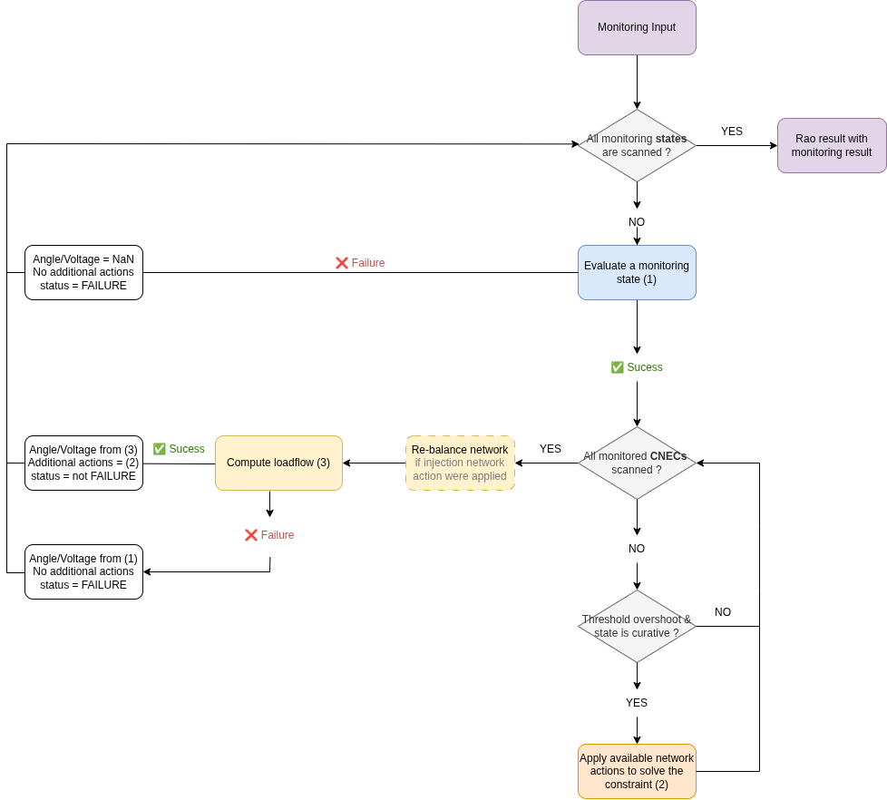
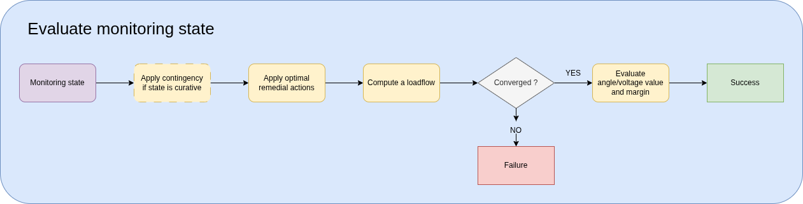
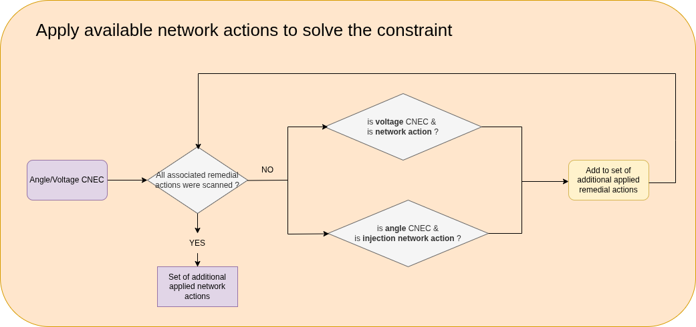

# The monitoring algorithm

> **Difference between voltage and angle monitoring**
>
> **Angle constraint** can only be solved using "injection" network actions** (i.e. network action with an elementary action that is a LoadAction or a GeneratorAction with a predefined setpoint) 
> whereas for a voltage constraint, all network actions are allowed.

The monitoring algorithm essentially works like this:

For each state that contains an angle/voltage CNEC:
- Evaluate the state by computing angle/voltage values and margins (see [this section](#evaluation-of-a-monitoring-state))
- If some **CNECs are constrained** and the state is **curative**, we try to solve the constraint by using the available network actions (see [this section](#solving-cnec-overshooting-constraint))
- If any injection network actions are applied, create and apply the redispatching that shall compensate for the change of generation/load:
    - The amount of power to re-dispatch is the net sum (generation - load) of power generations & loads affected by the RAs, before changing the set-points
    - Exclude from the re-dispatching all the generators & loads that were modified by an injection network action, since they should not be affected
- Re-evaluate the state after applying those additional network actions

Assemble all the angle/voltage CNECs results in one overall result

{.forced-white-background}

## Evaluation of a monitoring state

> ⚠️ WARNING️
>
> Only angle/voltage CNECs defined on **the preventive state and the last curative instant** can be monitored!
>
> If a voltage/angle CNEC is defined on an intermediate instant (ex. auto or not final curative instant), the CNEC will not be monitored (a warning will be issued) and
> will be ignored in the final augmented RAO result.

To evaluate a monitoring state:
1. Apply the contingency if the state is curative
2. Apply all the optimal remedial actions from the initial RAO result
3. Compute a loadflow
4. If the loadflow converges: compute the angles/voltages and margins for all angle/voltage CNECs:
- **Angle values** are the maximum phase difference between the 2 voltage levels
  Angle in degrees = 180 / pi * (max(angle on buses of exporting voltage level) - min(angle on buses of importing voltage level))
- **Voltage values** are the min and max voltages on the voltage level buses
- Compare the angles and voltages to their thresholds.
- Compute and save each CNEC security status (SECURE, HIGH_CONSTRAINT, LOW_CONSTRAINT, HIGH_AND_LOW_CONSTRAINTS, FAILURE)

{.forced-white-background}

## Solving CNEC overshooting constraint

> ⚠️ **If the state is preventive, do not apply any actions.** This could create inconsistencies with the other states.
>
> ⚠️ **Only network actions can be used.** The monitoring module is not an optimization module, so it cannot determine which setpoint to apply for a range action.

Identify and apply all the network actions that can be applied to solve the constrained CNEC
- If it is an **angle CNEC**, only injection network actions are allowed
- If it is a **voltage CNEC**, all network actions are allowed

{.forced-white-background}