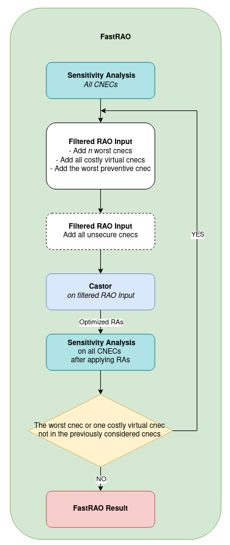

# Fast RAO

In general case, network congestion varies significantly across different transmission lines and system states.
This variation leads to an important observation: certain CNECs consistently maintain positive security margins,
regardless of which RAs are applied. 

This insight forms the foundation of Fast RAO: by excluding these consistently secure CNECs from the optimization process, 
we can significantly reduce the problem's complexity, resulting in a lighter optimization problem that can be solved more
quickly without compromising system security.

## Algorithm

Fast Rao gradually iteratively builds a set of the **critical** CNECs.Starting with an empty set of CNECs, at each iteration, we selectively adds only the CNECs that are
identified as critical for the problem. See the diagram below.

Running multiple RAO on smaller problems is more efficient than performing a single RAO on the
entire, much larger problem at once.

> Currently, Fast RAO does not suppport multi-curative optimization

## Parameters 

See [fast rao parameters section](../parameters/implementation-specific-parameters.md#number-of-cnecs-to-add)
