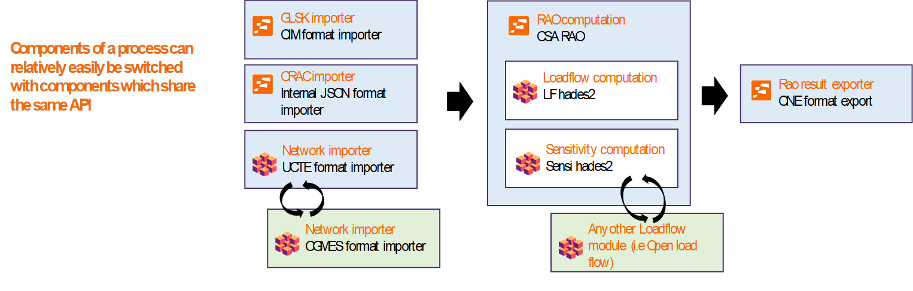
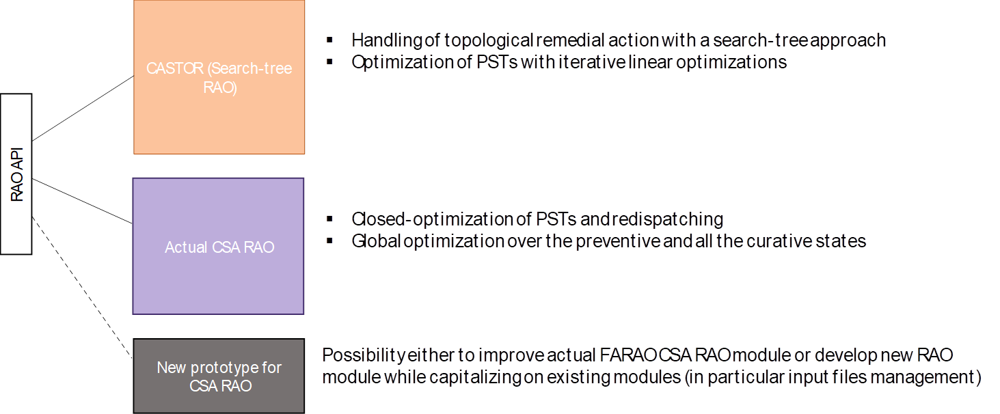

```{toctree}
---
caption: Contents of this website
maxdepth: 3
hidden: true
---

getting-started.md
glossary.md
input-data.md
output-data.md
algorithms.md
parameters.md
applications.md
```


# What is OpenRAO?

OpenRAO stands for "*Open Remedial Actions Optimizer*". It is an open-source
toolbox that aims at providing a modular engine for remedial actions optimisation
and an efficient solution for electrical power systems'  Coordinated Capacity Calculation,
Local Security Analysis and Coordinated Security Analysis...

OpenRAO is a [PowSyBl](https://www.powsybl.org) based toolbox that provides software
solutions for power systems coordinated capacity calculation and security analysis projects.
It is published on [GitHub](https://github.com/powsybl/powsybl-open-rao) under the [Mozilla Public License 2.0](https://www.mozilla.org/en-US/MPL/2.0/).

# Why choose OpenRAO?

Because we are convinced that sharing our expertise and knowledge is the most efficient way for
a successful energy transition and creation of a common European market. By contributing to OpenRAO,
all can benefit from this collaborative project amongst different national expertise on system operation,
without neglecting national specificities due to structural differences in network development between countries.

Results of remedial actions optimisation strongly impact the social economical welfare and the congestion costs.

How remedial actions are optimised can:
- avoid TSOs the need to invest in new infrastructure
- improve market prices formation and contribute to price convergence on the long term
- ease the integration of renewable energies
- reduce the costs due to national tariff

By providing a modular and open source tool, OpenRAO aims to :
- increase the global social economical welfare
- reduce the redispatching/contertrading costs
- ease the monitoring by national and european regulatory authorities by offering a transparent implementation
  of the methodologies approved

Unlike tools developed as a "black box", any interested actor can ensure its specifications are properly implemented;
this also helps operators to make this tool their own.

Due to multiple specificities between Capacity Calculation Regions and/or control area in terms of remedial actions,
OpenRAO offers a highly configurable solution and a collaborative approach where any actor (TSOs, NRAs, universities...)
can contribute to improve the tool for the benefits of the European community or adapt it to their local specificities.

The application of OpenRAO is not limited to Regional Coordination Centers Services, namely Coordinated Capacity
Calculation and Coordinated Security Analysis. It could also be used by TSOs for local Security Analysis (for instance,
local validation of the 70% margin required by the Clean Energy Package) or studies related to bidding zone review.

Transparency is in the DNA of this project. Functional and technical specifications, project's roadmap, code and its
level of quality are vailable on the website and updated frequently.

As Entso-e stated in 2020 [Annual Work Programme](https://eepublicdownloads.entsoe.eu/clean-documents/Publications/ENTSO-E%20general%20publications/200217_ENTSO-E_Annual%20Work%20Programme%202020%20(final).pdf):

> The future of regional TSO coordination and focus of the RCCs in the next years will be strongly driven by
> the integration of costly remedial actions in complex capacity calculation methodologies [...].
>
> Transparency and timely implementation of the [...] Network Codes are seen as paramount for
> achieving the optimal integration of the European market.

# Functional overview

[OpenRAO toolbox](https://github.com/powsybl/powsybl-open-rao) functional perimeter is declined following three main development axis:

- Business data modelisation - providing a java modelisation of all the business objects
for power systems coordinated capacity calculation and security analysis projects.
- Computation engines - providing open interface and efficient implementation of standard
tools for supporting capacity calculation projects.
- Exchange standards interface - providing importers and exporters to support ENTSO-E exchange
data interface in projects implementation.    

By extending the [PowSyBl](https://www.powsybl.org) framework, OpenRAO aims at providing an open, transparent,
and extandable implementation of the tools used for an efficient usage of the electricity transport
and distribution system.


Thanks to our modular architecture, implementing a new process in existing RAO modules or creating a new RAO based on an existing input format is fastened (see concrete example below)

{.forced-white-background}


Take benefit from our platform for optimisation with different methodologies already implemented for CACM/SO methodologies. Moreover, it is possible to contribute by adding your features/improvements in existing RAO modules and creating new ones if needed.

{.forced-white-background}

# Under the hood

OpenRAO is based on high quality open source frameworks.

{.main-page-logo}

[PowSyBl](https://www.powsybl.org/) is an open source Java library to assemble applications
for electrical power systems' simulation and analysis. This project is part of Linux Foundation
[LF Energy initiative](https://www.lfenergy.org/). Thanks to its internal IIDM format, OpenRAO is
natively compatible with both UCTE and CGMES network formats.

{.main-page-logo}

[OR-Tools](https://developers.google.com/optimization) is an open source software suite for
optimisation, tuned for tackling the world's toughest problems in vehicle routing, flows,
integer and linear programming, and constraint programming.
The choice of Google OR-tools was driven by its large compatibility with most of existing open source/commercial solvers,
including commercial solvers such Gurobi and Xpress when high performance is required.
