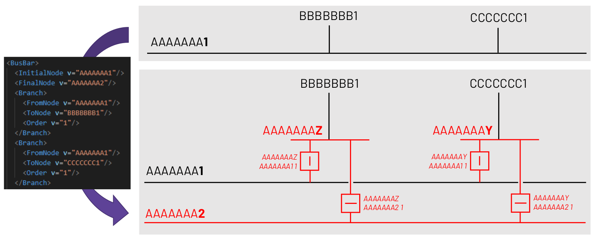

# CSE CRAC format

## Header overview

```xml
<?xml version="1.0" encoding="utf-8"?>
<CRACDocument xmlns:xsi="http://www.w3.org/2001/XMLSchema-instance" DtdVersion="1" DtdRelease="0" xsi:noNamespaceSchemaLocation="crac-document.xsd">
    <DocumentIdentification v="ruleToBeDefined"/>
    <DocumentVersion v="12"/>
    <DocumentType v="Z03"/>
    <ProcessType v="Z03"/>
    <SenderIdentification v="senderEIC" codingScheme="A01"/>
    <SenderRole v="A04"/>
    <ReceiverIdentification v="receiverEIC" codingScheme="A01"/>
    <ReceiverRole v="A36"/>
    <CreationDateTime v="2021-04-30T16:00:00Z"/>
    <TimeInterval v="2021-04-30T22:00Z/2021-04-30T23:00ZZ"/>
    <Domain v="10YDOM-1001A061T" codingScheme="A01"/>
    <CRACSeries>
        ...
    </CRACSeries>
</CRACDocument>
```
A crac document has a time interval for its validity and a lot of its sub-objects have their own time interval of validity as well.  
Therefore, **this document has to be imported for a specific datetime** – hourly-precise – to be able to select only the available elements for this datetime.

## Branch

In the PowSyBl vocabulary, **a 'Branch' is an element which is connected to two terminals** (lines, tie-lines, transformers, etc.)  
As this object is used almost everywhere in the CRAC, it is introduced first.
A branch has few mandatory tags that should be filled in for OpenRAO to consider them : **FromNode, ToNode, Order.** They refer to existing network elements by their UCTE code.  
However, a branch has also a lot of optional tags that are described right below this example.

```xml
<Branch>
    <Name v="Branch_1"/>
    <EIC v="Random EIC"/>
    <AlwaysSelected v="true"/>
    <FromNode v="BBE2AA1 "/>
    <ToNode v="BBE3AA1 "/>
    <Order v="1"/>
    <ImaxAfterOutage v="100" unit="Pct"/>
    <ImaxAfterCRA v="100" unit="Pct"/>
    <IlimitMNE_AfterOutage v="110" unit="Pct"/>
    <IlimitMNE_AfterCRA v="6500" unit="A"/>
    <Vn v="380" unit="kV"/>
    <minMargin v="70" unit="Pct"/>
    <Direction v="DIRECT"/>
    <Selected v="true"/>
    <Sensitivity v="3"/>
    <PTDFListRef>
        <PTDF>
            <Factor unit="Pct" v="4.5"/>
            <Country v="Country_1"/>
        </PTDF>
        <PTDF>
            <Factor unit="Pct" v="-2.3"/>
            <Country v="Country_2"/>
        </PTDF>
    </PTDFListRef>
    <RemedialActions>
        <Name v="Remedial_Action_1"/>
        <Name v="Remedial_Action_2"/>
    </RemedialActions>
</Branch>
```

- **Name** : Alternative way to describe the branch with useful information to identify it more easily when reading logs and results
- **EIC** : Identification
- **AlwaysSelected** : OpenRAO does not use this tag, it only reads the selected tag one
- **selected** : If selected is false, OpenRAO will not consider the margin on this branch in its optimization. Default value is true
- **Imax{...} and Ilimit{...}** : Please refer respectively to the [CriticalBranches](#criticalbranches) and [Monitored Elements](#monitoredelements) sections at the end of this page
- **Vn** : It is the nominal voltage, but OpenRAO reads is directly in the network therefore it is useless to fill it
- **minmargin** : OpenRAO does not interact with this tag
- **Direction** : Has to be DIRECT, OPPOSITE or BIDIR. **If the Branch is defined in a BaseCaseBranch, a CriticalBranch 
or a MonitoredElement, this tag is mandatory.** Please refer to [this section](json.md#flow-cnecs) of JSON CRAC Format
for more information on the behavior of OpenRAO according to the different direction values.
- **Status** : Must be OPEN or CLOSE for a branch involved in a topological action. Default value is OPEN. See an example in the [topological actions](#network-actions) section of this page.
- **Sensitivity** : OpenRAO does not interact with this tag
- **PTDFListRef** : OpenRAO does not interact with this tag
- **Remedial actions** : These remedial actions will be available with OnConstraint usage rule for the branches they are associated to

## Outages
```xml
<CRACSeries>
    <Outages>
        <Outage>
            <Name v="outage_1"/>
            <Branch>
                <FromNode v="BBE1AA1 "/>
                <ToNode v="BBE2AA1 "/>
                <Order v="1"/>
            </Branch>
        </Outage>
        <Outage>
            <Name v="outage_2"/>
            <Branch>
                <FromNode v="BBE1AA1 "/>
                <ToNode v="BBE3AA1 "/>
                <Order v="1"/>
            </Branch>
            <Branch>
                <FromNode v="BBE1AA1 "/>
                <ToNode v="BBE2AA1 "/>
                <Order v="1"/>
            </Branch>
        </Outage>
    </Outages>
    ...
</CRACSeries>
```

**Outages are also commonly called ‘Contingencies’.**  
Each outage with multiple associated network elements must have them listed as showcased in the "outage_2" example above.

## RemedialActions

```xml
<CRACSeries>
    ...
    <RemedialActions>
        <RemedialAction>
            <Name v="PST_pra"/>
            <TimeInterval v="2021-04-30T22:00Z/2021-04-30T23:00ZZ"/>
            <Operator v="IT"/>
            <Application v="PREVENTIVE"/>
            <SharedWith v="CSE"/>
            ...
        </RemedialAction>
    </RemedialActions>
</CRACSeries>
```

A remedial action can be of different types, but they will always have :
- A name
- A TimeInterval : Has to contain the import datetime.
- An operator : Represents a country in the UCTE country code format
- A tag Application : Instant when the remedial action can be applied (SPS should be written for Instant Auto)
- A tag SharedWith

**The SharedWith tag**

This tag defines the usage rule of the remedial action. You can refer to [this section](json.md#remedial-actions-and-usages-rules) for further explanation on the usage rule behavior.

If SharedWith is "CSE" : FreeToUse  
If SharedWith is a UCTE country code : OnFlowConstraintInCountry in the country filled in     
If SharedWith is "None" : OnConstraint only for its associated CNECs (c.f. the Branch section above)

### Range Actions

#### PST Range Actions

```xml
<CRACSeries>
    ...
    <RemedialActions>
        <RemedialAction>
            <Name v="PST_pra"/>
            <TimeInterval v="2021-04-30T22:00Z/2021-04-30T23:00ZZ"/>
            <Operator v="IT"/>
            <Application v="PREVENTIVE"/>
            <SharedWith v="CSE"/>
            <PstRange>
                <Branch>
                    <FromNode v="BBE2AA1 "/>
                    <ToNode v="BBE3AA1 "/>
                    <Order v="1"/>
                </Branch>
                <VariationType v="ABSOLUTE"/>
                <Min v="-2"/>
                <Max v="2"/>
            </PstRange>
        </RemedialAction>
    </RemedialActions>
</CRACSeries>
```

A PST Range Action is defined by its PstRange attribute which contains:
- a Branch
- a VariationType : For now the only VariationType handled by OpenRAO is "ABSOLUTE" : the mix/max admissible taps of the PST.
- a Min value : Has to be an Integer
- a Max value : Must be an Integer >= Min value

OpenRAO minimum tap = max(Network minimum tap, Crac minimum tap)  
OpenRAO maximum tap = min(Network maximum tap, Crac maximum tap)

#### HVDC Range Actions

```xml
<CRACSeries>
    ...
    <RemedialActions>
        <RemedialAction>
            <Name v="PRA_HVDC"/>
            <TimeInterval v="2021-04-30T22:00Z/2021-04-30T23:00ZZ"/>
            <Operator v="FR"/>
            <Application v="PREVENTIVE"/>
            <SharedWith v="CSE"/>
            <HVDCRange>
                <HVDCNode>
                    <FromNode v="BBE2AA12"/>
                    <ToNode v="FFR3AA12"/>
                    <Order v="1"/>
                </HVDCNode>
                <VariationType v="ABSOLUTE"/>
                <Min v="-100"/>
                <Max v="2000"/>
            </HVDCRange>
        </RemedialAction>
    </RemedialActions>
</CRACSeries>
```

For now the only VariationType handled by OpenRAO is "ABSOLUTE" : the min/max admissible set-points of the HVDC.   
**An HVDC Range Action is modelled by an Injection range Action** (the HVDC line is disconnected and replaced by two injections, one on each side of the line, with opposite keys of 1 and -1). 
OpenRAO creates the opposite keys by itself, therefore there is no need to specify it.  
⚠️*There isn't any check performed to verify that an applied set-point is between the ranges' min and max.*

### Network Actions

#### generator action

```xml
<CRACSeries>
    ...
    <RemedialActions>
        <RemedialAction>
            <Name v="cra_1"/>
            <TimeInterval v="2021-04-30T22:00Z/2021-04-30T23:00ZZ"/>
            <Operator v="FR"/>
            <Application v="CURATIVE"/>
            <SharedWith v="None"/>
            <Generation>
                <Node>
                    <Name v="FFR1AA1 "/>
                    <VariationType v="ABSOLUTE"/>
                    <Value v="0"/>
                </Node>
            </Generation>
        </RemedialAction>
    </RemedialActions>
</CRACSeries>
```

For now the only VariationType handled by OpenRAO is "ABSOLUTE", on the node you filled in, the new set-point value will be the one you defined (in MW).

#### switch actions and terminals connection actions

```xml
<CRACSeries>
    ...
    <RemedialActions>
        <RemedialAction>
            <Name v="cra_1"/>
            <TimeInterval v="2021-04-30T22:00Z/2021-04-30T23:00ZZ"/>
            <Operator v="FR"/>
            <Application v="CURATIVE"/>
            <SharedWith v="None"/>
            <Status>
                <Branch>
                    <FromNode v="FFR1AA1 "/>
                    <ToNode v="FFR3AA1 "/>
                    <Order v="1"/>
                    <Status v="OPEN"/>
                </Branch>
            </Status>
        </RemedialAction>
    </RemedialActions>
</CRACSeries>
```

As mentioned earlier, the status must be OPEN or CLOSE and default value is OPEN.
The elementary action will be a switch action if the network element is a switch, otherwise the network element must be
a connectable and the action will be a terminals connection action.

#### bus bar change

```xml
<CRACSeries>
    ...
    <RemedialActions>
        <RemedialAction>
            <Name v="RA3"/>
            <TimeInterval v="2020-03-12T23:00Z/2020-03-13T00:00Z"/>
            <Operator v="BE"/>
            <Application v="CURATIVE"/>
            <SharedWith v="CSE"/>
            <BusBar>
                <InitialNode v="BBE1AA11"/>
                <FinalNode v="BBE1AA12"/>
                <Branch>
                    <FromNode v="BBE1AA11"/>
                    <ToNode v="BBE2AA1*"/>
                    <Order v="1"/>
                </Branch>
                <Branch>
                    <FromNode v="BBE1AA11"/>
                    <ToNode v="BBE3AA1*"/>
                    <Order v="1"/>
                </Branch>
            </BusBar>
        </RemedialAction>
        ...
    </RemedialActions>
</CRACSeries>
```

These remedial actions consist in the changing of one or multiple lines' end from one bus to another.  
In the example above, the remedial action would move:
- Line BBE1AA11 BBE2AA1* 1 (* is a wildcard) on the left side from bus BBE1AA11 (InitialNode) to bus BBE1AA12 (FinalNode)
- Line BBE1AA11 BBE3AA1* 1 (* is a wildcard) on the left side from bus BBE1AA11 (InitialNode) to bus BBE1AA12 (FinalNode)

These modifications are actually impossible to do easily in a PowSyBl network without modifying its whole structure.  
For this reason, the user shall pre-process the network in order to create fictitious buses and switches that shall be opened 
or closed by these remedial actions.  

  

Using [CseCracCreationParameters](creation-parameters.md#cse-specific-parameters), OpenRAO can then map these remedial actions to the switches 
created by the user, and interpret BusBar remedial actions as [SwitchPairs](../crac.md#switch-pair).

## CriticalBranches

It should contain a BaseCaseBranches tag and at least one CriticalBranch

### BaseCaseBranches

```xml
<CRACSeries>
    ...
    <CriticalBranches>
        ...
        <BaseCaseBranches>
            <TimeInterval v="2021-04-30T22:00Z/2021-04-30T23:00ZZ"/>
            <Branch>
                <Name v="basecase_branch_1"/>
                <FromNode v="NNL1AA1 "/>
                <ToNode v="NNL3AA1 "/>
                <Order v="1"/>
                <Imax unit="A" v="4000"/>
                <Direction v="OPPOSITE"/>
                <Selected v="true"/>
            </Branch>
            <Branch>
                <Name v="basecase_branch_2"/>
                <FromNode v="NNL1AA1 "/>
                <ToNode v="NNL2AA1 "/>
                <Order v="1"/>
                <Imax unit="A" v="4500"/>
                <Direction v="DIRECT"/>
            </Branch>
        </BaseCaseBranches>
    </CriticalBranches>
</CRACSeries>
```

BaseCaseBranches is made of:
- A TimeInterval : Must contain the import datetime.
- A List of branches

For each branch in the list, if Imax is provided, **a CNEC will be created on Preventive state.**

### CriticalBranch

```xml
<CRACSeries>
    ...
    <CriticalBranches>
        ...
        <CriticalBranch>
            <TimeInterval v="2021-04-30T22:00Z/2021-04-30T23:00ZZ"/>
            <Outage v="outage_1"/>
            <Branch>
                <Name v="French line 1"/>
                <FromNode v="FFR1AA1 "/>
                <ToNode v="FFR2AA1 "/>
                <Order v="1"/>
                <ImaxAfterOutage unit="A" v="4318"/>
                <ImaxAfterCRA unit="A" v="3099"/>
                <Direction v="OPPOSITE"/>
            </Branch>
        </CriticalBranch>
    </CriticalBranches>
</CRACSeries>
```

Each one needs at least these information :  
- A TimeInterval : Has to contain the import datetime.
- An outage : Must be an outage name existing in the Outages section
- A branch

For each critical branch, given an attribute ImaxAfter{Instant}, **a CNEC on the given state will be created :**
- ImaxAfterOutage -> Instant Outage
- ImaxAfterSPS -> Instant Auto
- ImaxAfterCRA -> Instant Curative

## MonitoredElements

```xml
<CRACSeries>
    ...
    <MonitoredElements>
        <MonitoredElement>
            <TimeInterval v="2021-04-30T22:00Z/2021-04-30T23:00ZZ"/>
            <Branch>
                <Name v="Branch_1"/>
                <FromNode v="NNL1AA1 "/>
                <ToNode v="NNL3AA1 "/>
                <Order v="1"/>
                <IlimitMNE_AfterOutage v="120" unit="Pct"/>
                <IlimitMNE_AfterSPS v="5750" unit="A"/>
                <IlimitMNE_AfterCRA v="5500" unit="A"/>
                <IlimitMNE v="100" unit="Pct"/>
                <Vn v="380" unit="kV"/>
                <Direction v="DIRECT"/>
            </Branch>
        </MonitoredElement>
    </MonitoredElements>
</CRACSeries>
```

A MonitoredElement always has a TimeInterval and a branch.  
It will not be optimized by OpenRAO, however it will be monitored. In other words, **on this element, OpenRAO cannot reduce the margin compared to its initial value.**

First, if IlimitMNE is filled in, a CNEC on Preventive state will be created. Then, **for each outage in the Outages tag and for each attribute IlimitMNE_After{Instant} that is present, a CNEC will be created on the given state**:
- IlimitMNE_AfterOutage -> Instant Outage
- IlimitMNE_AfterSPS -> Instant Auto
- IlimitMNE_AfterCRA -> Instant Curative
  