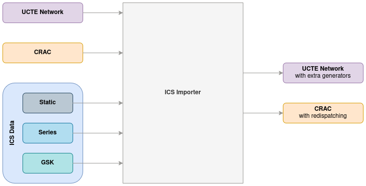

# ICS

ICS data contains necessary data to define redispatching actions' specific constraints. ICS data are only used for
[costly computations](../../algorithms/castor/linear-problem/inter-temporal-constraints.md).

### Static

Static ICS data defines a remedial action's generator's static constraints:

| Name                                       | Details                                                                                                        |
|--------------------------------------------|----------------------------------------------------------------------------------------------------------------|
| RA RD ID                                   | Remedial action ID                                                                                             |
| TSO                                        | TSO location  ("CZ", "BE", "PL", "D2", ...).                                                                   |
| Preventive                                 | RA is applied before any contingency occurs (true/false)                                                       |
| Curative                                   | RA is applied after given contingency occurs (true/false)                                                      |
| Time From                                  |                                                                                                                |
| Time To                                    |                                                                                                                |
| Generator Name                             | RA's associated generator's name                                                                               |
| RD Description mode                        | One of two values possible: "NODE" or "GSK"                                                                    |
| UCT Node or GSK ID                         | Name of connection node or ID of GSK as specified in GSK ICS data                                              |
| Minimum Redispatch [MW]                    | Minimum amount of redispatch in MW.                                                                            |
| Fuel type                                  | Fuel type one of the following: "Coal", "Hydro(NonPS)", "Nuclear", "Oil", "PumpStorage", "PV", "Wing", "Other" |
| Minimum up-time [h]                        | Minimum uptime for RA RD in hours.                                                                             |
| Minimum down-time [h]                      | Minimum downtime for RA RD in hours.                                                                           |
| **Maximum positive power gradient [MW/h]** | Maximum positive power gradient for RA RD in MW/h.                                                             |
| **Maximum negative power gradient [MW/h]** | Maximum negative power gradient for RA RD in MW/h.                                                             |
| **Lead time [h]**                          | Lead time for activation of RA RD in h.                                                                        |
| **Lag time [h]**                           | Lag time for deactivation of RA RD in h.                                                                       |
| Startup allowed                            | To indicate if RA RD can be started from standstill. One of two values possible: "TRUE", "FALSE".              |
| Shutdown allowed                           | To indicate if RA RD can be shutdown. One of two values possible: "TRUE", "FALSE".                             |

### Series

This CSV defines a remedial action's generator's operating program P0, and allowed undershoot/overshoot from P0 (RDP-
and RDP+, positive values). These values are defined as time series over 24 hours.

### GSK

| Name   | Details                                                                                  |
|--------|------------------------------------------------------------------------------------------|
| GSK ID | Unique identifier of GSK                                                                 |
| Node   | UCT code of the node described with 8 characters.                                        |
| Weight | Weight for GSK at respective node.  Sum of weights for all nodes in one GSK should be 1. |

