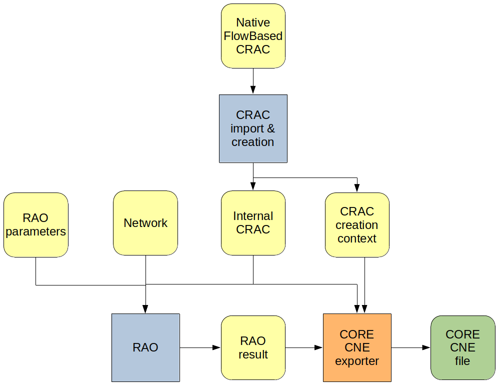
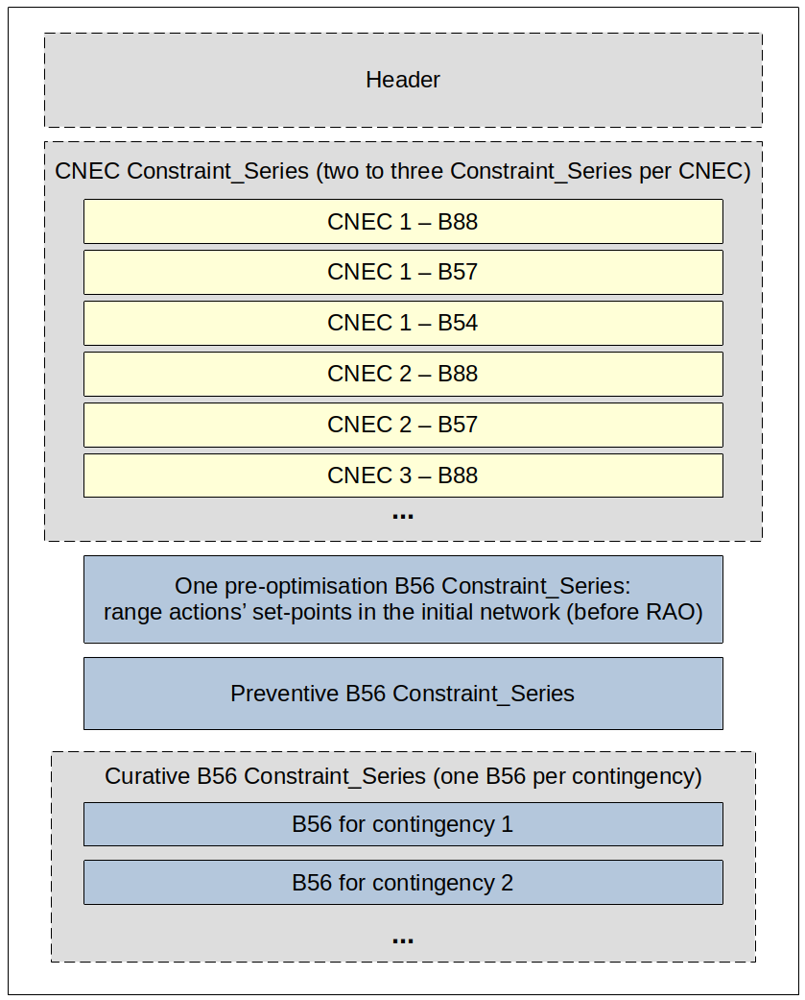

# CORE CNE File

## Introduction

The CORE CNE file is the standard RAO output file for the CORE CC process.  
The [OpenRAO toolbox](https://github.com/powsybl/powsybl-open-rao/blob/main/data/rao-result/rao-result-io/rao-result-cne/core-cne-exporter/src/main/java/com/powsybl/openrao/data/raoresult/io/cne/core/CoreCneExporter.java)
allows exporting [RAO results](rao-result.md) in a CORE CNE file using a [UcteCracCreationContext](../input-data/crac/creation-context.md#ucte-implementation)
and specific properties.

{.forced-white-background}

## Java API

After completing the RAO, the user can export the [`RaoResult`](rao-result.md) object as a CORE CNE file using the `write` method with the `"CORE-CNE""` format:

~~~java
// RaoResult interface
public void write(String format, CracCreationContext cracCreationContext, Properties properties, OutputStream outputStream)
~~~

With:
- **raoResult**: the [RaoResult](rao-result.md) object containing selected remedial actions and flow results.
- **cracCreationContext**: the [CracCreationContext object](../input-data/crac/creation-context.md) generated during
  [CRAC creation](../input-data/crac/import.md). CORE CNE export only handles [UcteCracCreationContext](../input-data/crac/creation-context.md#ucte-implementation)
  subtype, because it follows the UCTE conventions.
- **properties**: a specific object that te user should define, containing meta-information that will be written
  in the header of the CNE file as well as relevant RAO parameters:
    - **`"rao-result.export.core-cne.document-id"`**: document ID to be written in "mRID" field
    - **`"rao-result.export.core-cne.revision-number"`**: integer to be written in "revisionNumber" field
    - **`"rao-result.export.core-cne.domain-id"`**: domain ID to be written in "domain.mRID" field (usually an [ENTSO-E EICode](https://www.entsoe.eu/data/energy-identification-codes-eic/))
    - **`"rao-result.export.core-cne.process-type"`**: the ENTSO-E code of the process type, to be written in "process.processType" field:
        - **A48**: Day-ahead capacity determination, used for CORE region
        - ~~**Z01**~~: Day-ahead capacity determination, used for SWE region (so don't use it here)
    - **`"rao-result.export.core-cne.sender-id"`**: ID of the sender of the CNE document, to be written in "sender_MarketParticipant.mRID" field
      (usually an [ENTSO-E EICode](https://www.entsoe.eu/data/energy-identification-codes-eic/))
    - **`"rao-result.export.core-cne.sender-role"`**: ENTSO-E code defining the role of the sender of the CNE document, to be written in
      "sender_MarketParticipant.marketRole.type" field:
        - **A04**: system operator
        - **A36**: capacity coordinator
        - **A44**: regional security coordinator
    - **`"rao-result.export.core-cne.receiver-id"`**: ID of the receiver of the CNE document, to be written in "receiver_MarketParticipant.mRID" field
      (usually an [ENTSO-E EICode](https://www.entsoe.eu/data/energy-identification-codes-eic/))
    - **`"rao-result.export.core-cne.receiver-role"`**: ENTSO-E code defining the role of the receiver of the CNE document, to be written in
      "receiver_MarketParticipant.marketRole.type" field. Same value options as senderRole.
    - **`"rao-result.export.core-cne.time-interval"`**: time interval of document applicability, to be written in "time_Period.timeInterval" field. It should
      be formatted as follows: "YYYY-MM-DDTHH:MMZ/YYYY-MM-DDTHH:MMZ" (start date / end date).
    - **`"rao-result.export.core-cne.relative-positive-margins"`** (optional, default is `"false"`)
    - **`"rao-result.export.core-cne.with-loop-flows"`** (optional, default is `"false"`)
    - **`"rao-result.export.core-cne.mnec-acceptable-margin-diminution"`** (optional, default is `"0"`)

Here is a complete example:

~~~java
// Fetch input data (network) and parameters
Network network = ...
RaoParameters raoParameters = ...
// Create CRAC
CracCreationContext cracCreationContext = CracCreators.createCrac(...);
Crac crac = cracCreationContext.getCrac();
// Run RAO
RaoResult raoResult = Rao.find(...).run(...)
// Set CORE-CNE export properties
Properties properties = new Properties();
properties.setProperty("rao-result.export.core-cne.document-id", "DOCUMENT_ID");
properties.setProperty("rao-result.export.core-cne.revision-number", "1");
properties.setProperty("rao-result.export.core-cne.domain-id", "DOMAIN_ID");
properties.setProperty("rao-result.export.core-cne.process-type", "A48"); // DAY_AHEAD_CC
properties.setProperty("rao-result.export.core-cne.sender-id", "SENDER_ID");
properties.setProperty("rao-result.export.core-cne.sender-role", "A44"); // REGIONAL_SECURITY_COORDINATOR
properties.setProperty("rao-result.export.core-cne.receiver-id", "RECEIVER_ID");
properties.setProperty("rao-result.export.core-cne.receiver-role", "A36"); // CAPACITY_COORDINATOR
properties.setProperty("rao-result.export.core-cne.time-interval", "2021-10-30T22:00Z/2021-10-31T23:00Z");
switch (raoParameters.getObjectiveFunctionParameters().getType()) {
    case MAX_MIN_RELATIVE_MARGIN -> properties.setProperty("rao-result.export.core-cne.relative-positive-margins", "true");
    case MAX_MIN_MARGIN -> properties.setProperty("rao-result.export.core-cne.relative-positive-margins", "false");
}
if (raoParameters.hasExtension(LoopFlowParametersExtension.class)) {
    properties.setProperty("rao-result.export.core-cne.with-loop-flows", "true");
}
if (raoParameters.hasExtension(MnecParametersExtension.class)) {
    properties.setProperty("rao-result.export.core-cne.mnec-acceptable-margin-diminution", String.valueOf(raoParameters.getExtension(MnecParametersExtension.class).getAcceptableMarginDecrease()));
}
// Export CNE to output stream
OutputStream os = ...
raoResult.write("CORE-CNE", cracCreationContext, properties, os);
~~~

## Contents of the CORE CNE file

Here is an overview of the general structure of the CORE CNE document, detailed in the following sections:

### Header

The header contains meta-information about the process.  
Refer to the [JAVA API](#java-api) section for more details.

Example:

~~~xml
<?xml version="1.0" encoding="UTF-8" standalone="yes"?>
<CriticalNetworkElement_MarketDocument xsi:schemaLocation="iec62325-451-n-cne_v2_4_FlowBased_v04.xsd" xmlns="urn:iec62325.351:tc57wg16:451-n:cnedocument:2:4" xmlns:xsi="http://www.w3.org/2001/XMLSchema-instance">
    <mRID>DOCUMENT_ID</mRID>
    <revisionNumber>1</revisionNumber>
    <type>B06</type>
    <process.processType>A48</process.processType>
    <sender_MarketParticipant.mRID codingScheme="A01">SENDER_ID</sender_MarketParticipant.mRID>
    <sender_MarketParticipant.marketRole.type>A44</sender_MarketParticipant.marketRole.type>
    <receiver_MarketParticipant.mRID codingScheme="A01">RECEIVER_ID</receiver_MarketParticipant.mRID>
    <receiver_MarketParticipant.marketRole.type>A36</receiver_MarketParticipant.marketRole.type>
    <createdDateTime>2021-12-30T15:09:43Z</createdDateTime>
    <time_Period.timeInterval>
        <start>2021-10-30T22:00Z</start>
        <end>2021-10-31T23:00Z</end>
    </time_Period.timeInterval>
    <domain.mRID codingScheme="A01">DOMAIN_ID</domain.mRID>
    <TimeSeries>
        <mRID>CNE_RAO_CASTOR-TimeSeries-1</mRID>
        <businessType>B54</businessType>
        <curveType>A01</curveType>
        <Period>
            <timeInterval>
                <start>2019-01-07T23:00Z</start>
                <end>2019-01-08T00:00Z</end>
            </timeInterval>
            <resolution>PT60M</resolution>
            <Point>
                <position>1</position>
...
~~~

### CNEC results

CNEC results after RAO are reported in **Constraint_Series** tags, with **businessType** value **B88**, **B57** or **B54**.

Example:
~~~xml
<Constraint_Series>
    <mRID>ME_one_co_one_dir</mRID>
    <businessType>B88</businessType>
    <Party_MarketParticipant>
        <mRID codingScheme="A01">10XFR-RTE------Q</mRID>
    </Party_MarketParticipant>
    <optimization_MarketObjectStatus.status>A52</optimization_MarketObjectStatus.status>
    <Contingency_Series>
        <mRID>Co_one</mRID>
        <name>Co_one</name>
    </Contingency_Series>
    <Monitored_Series>
        <mRID>ME_one_co_one_dir</mRID>
        <name>ME_one|Co_one</name>
        <RegisteredResource>
            <mRID codingScheme="A02">ME_one_co_one_dir</mRID>
            <name>ME_one</name>
            <Measurements>
                <measurementType>A01</measurementType>
                <unitSymbol>MAW</unitSymbol>
                <positiveFlowIn>A02</positiveFlowIn>
                <analogValues.value>1118</analogValues.value>
            </Measurements>
            <Measurements>
                <measurementType>A02</measurementType>
                <unitSymbol>AMP</unitSymbol>
                <positiveFlowIn>A01</positiveFlowIn>
...
~~~

#### mRID
Unique ID of the CNEC as defined in the native CRAC file.

#### businessType
Three possible values for CNEC results:
- **B88**: these are the CNEC initial results (i.e. before remedial action optimisation)
- **B57**: these are the CNEC intermediate results, after preventive remedial actions optimisation and before curative
  remedial actions optimisation
- **B54**: these are the CNEC final results, after curative remedial actions optimisation
  > ⚠️  **NOTE**
  > In order to align OpenRAO with other capacity calculation tools, **B54** series are not exported for CNECs if no
  > curative remedial actions were applied (even though it makes sense to export them, because PATL results are not
  > exported in **B57** series, as explained further in this article)

#### Party_MarketParticipant

mRID: [ENTSO-E EICode](https://www.entsoe.eu/data/energy-identification-codes-eic/) of the CNEC's operator (in mRID tag).

#### optimization_MarketObjectStatus.status

Two possible values:
- **A52**: the CNEC is [optimised](../input-data/crac/json.md#cnecs)
- **A49**: the CNEC is [monitored](../input-data/crac/json.md#cnecs)
  > ⚠️  **NOTE**
  > In order to align OpenRAO with other capacity calculation tools, CNECs that are both optimised and monitored are
  > currently only exported with an **A52** type

#### Contingency_Series (optional)

Exists if the CNEC is monitored after a contingency (if the CNEC is preventive, this tag does not exist):
- **mRID**: unique ID of the contingency as it is defined in the native CRAC
- **name**: name of the contingency as it is defined in the native CRAC

#### Monitored_Series

##### mRID

Unique ID of the CNEC as defined in the native CRAC file (same as mRID of Constraint_Series).

##### name

Formatted "native name|contingency name", where:
- "native name" is the name of the CNEC as defined in the native CRAC file;
- "contingency name" is the name of the contingency referenced in Contingency_Series.

#### RegisteredResource

##### mRID

Unique ID of the CNEC as defined in the native CRAC file (same as mRID of Constraint_Series).

##### name

The name of the CNEC as defined in the native CRAC file.

##### Measurements

- measurementType: type of measurement, possible values are:
    - **A01**: flow
    - **A02**: PATL (input data)
    - **A07**: TATL (input data)
    - **A03**: flow reliability margin (input data)
    - **Z11**: absolute zonal PTDF sum
    - **Z12**: flow margin in regard to the PATL
    - **Z13**: objective function value for this CNEC in regard to the PATL  
      This value is equal to Z12 unless RAO is run with [relative positive margins](../parameters/business-parameters.md#type),
      in which case it will be equal to Z12 / Z11 when Z12 is positive.
    - **Z14**: flow margin in regard to the TATL
    - **Z15**: objective function value for this CNEC in regard to the TATL  
      This value is equal to Z14 unless RAO is run with [relative positive margins](../parameters/business-parameters.md#type),
      in which case it will be equal to Z14 / Z11 when Z14 is positive.
    - **Z16**: loop-flow
    - **Z17**: loop-flow threshold (input data)
- unitSymbol: unit of measurement, possible values are:
    - **MAW**: megawatt
    - **AMP**: ampere
    - **C62**: dimensionless
- positiveFlowIn: sign of the value, possible values are:
    - **A01**: measurement is positive (its actual value is analogValues.value)
    - **A02**: measurement is negative (its actual value is -analogValues.value)
- analogValues.value: absolute value of the measurement

Depending on the business type of the Constraint_Series, some or all of these measurements are expected:

| Measurement type | Measurement         | Unit(s)  | Exported in B88 (initial) | Exported in B57 (after PRA) | Exported in B54 (after CRA) |
|------------------|---------------------|----------|---------------------------|-----------------------------|-----------------------------|
| **A01**          | Flow                | MAW      | ✔️                         | ✔️                           | ✔️                           |
| **A02**          | PATL                | MAW, AMP | ✔️                         |                             | ✔️                           |
| **A07**          | TATL                | MAW, AMP | ✔️                         | ✔️                           |                             |
| **A03**          | FRM                 | MAW      | ✔️                         | ✔️                           | ✔️                           |
| **Z11**          | PTDF sum            | C62      | ✔️                         | ✔️                           | ✔️                           |
| **Z12**          | PATL margin         | MAW      | ✔️                         |                             | ✔️                           |
| **Z13**          | PATL objective      | MAW      | ✔️                         |                             | ✔️                           |
| **Z14**          | TATL margin         | MAW      | ✔️                         | ✔️                           |                             |
| **Z15**          | TATL objective      | MAW      | ✔️                         | ✔️                           |                             |
| **Z16**          | Loop-flow           | MAW      | ✔️                         | ✔️                           | ✔️                           |
| **Z17**          | Loop-flow threshold | MAW      | ✔️                         | ✔️                           | ✔️                           |

#### RemedialAction_Series (optional)

This tag is used to report remedial actions that were selected by the RAO for the CNEC's state:
- If a PRA is selected for the CNEC's state, it will be reported inside the B54 & B57 Constraint_Series of this CNEC
- If a CRA is selected for the CNEC's state, it will be reported inside the B57 Constraint_Series of this CNEC

##### mRID

Unique ID of the selected remedial action, as identified in the original CRAC.

##### name

Name of the selected remedial action, as identified in the original CRAC.

##### applicationMode_MarketObjectStatus.status

Two possible values:
- **A18**: the remedial action was selected in preventive
- **A19**: the remedial action was selected in curative

### Remedial action results

In addition to being reported inside CNECs' Constraint_Series, remedial actions have their own Constraint_Series
to report the ones selected by the RAO.  
The remedial actions' Constraint series all have a **B56 businessType**.

Example:

~~~xml
<Constraint_Series>
    <mRID>RAseries_27295</mRID>
    <businessType>B56</businessType>
    <Contingency_Series>
        <mRID>Co_one</mRID>
        <name>Co_one</name>
    </Contingency_Series>
    <RemedialAction_Series>
        <mRID>pst_one</mRID>
        <name>pst_one</name>
        <applicationMode_MarketObjectStatus.status>A19</applicationMode_MarketObjectStatus.status>
        <Party_MarketParticipant>
            <mRID codingScheme="A01">10X1001A1001A094</mRID>
        </Party_MarketParticipant>
        <RegisteredResource>
            <mRID codingScheme="A01">pst_one</mRID>
            <name>FPRAGN22 FDEPHT21 1</name>
            <pSRType.psrType>A06</pSRType.psrType>
            <marketObjectStatus.status>A26</marketObjectStatus.status>
            <resourceCapacity.defaultCapacity>-8</resourceCapacity.defaultCapacity>
            <resourceCapacity.unitSymbol>C62</resourceCapacity.unitSymbol>
        </RegisteredResource>
    </RemedialAction_Series>
    <RemedialAction_Series>
        <mRID>network_three</mRID>
        <name>network_three</name>
        <applicationMode_MarketObjectStatus.status>A18</applicationMode_MarketObjectStatus.status>
        <Party_MarketParticipant>
            <mRID codingScheme="A01">10XFR-RTE------Q</mRID>
        </Party_MarketParticipant>
    </RemedialAction_Series>
...
~~~

#### mRID

Random ID, unique in the CNE document.

#### businessType

Always **B56**, to signify that this is a remedial-action Constraint_Series.

#### Contingency_Series (optional)

If this tag exists, then this Constraint_Series reports selected **curative** remedial actions by the RAO, after the
contingency defined in this tag:
- **mRID**: unique ID of the contingency as it is defined in the native CRAC
- **name**: name of the contingency as it is defined in the native CRAC

#### RemedialAction_Series

##### mRID

Unique ID of the selected remedial action, as identified in the original CRAC.

##### name

Name of the selected remedial action, as identified in the original CRAC.

##### applicationMode_MarketObjectStatus.status (optional)

If this tag exists, it can have one of two values:
- **A18**: the remedial action was selected in preventive
- **A19**: the remedial action was selected in curative

If it doesn't exist, it means that the following describes the remedial action **before** optimisation (only useful
to know the initial set-points of range actions).

##### Party_MarketParticipant

[ENTSO-E EICode](https://www.entsoe.eu/data/energy-identification-codes-eic/) of the remedial action's operator (in mRID tag).

##### RegisteredResource (optional)

This tag is only exported for **range actions**, to hold their set-point values.

##### mRID

Unique ID of the selected remedial action, as identified in the original CRAC (same as mRID of RemedialAction_Series).

##### name

Identifier of range action's UCTE network element.

##### pSRType.psrType

Only one possible value for now:
- **A06**: remedial action is a PST

##### resourceCapacity.defaultCapacity

Value of the range action's set-point (tap position for a PST range action).
- If **applicationMode_MarketObjectStatus.status** tag does not exist, this is the remedial action's initial set-point
  in the network.
- If it does and is equal to **A18**, this is the optimal preventive set-point.
- If it does and is equal to **A19**, this is the optimal curative set-point, for contingency defined in
  **Contingency_Series** above.

##### resourceCapacity.unitSymbol

Unit of the set-point given in **resourceCapacity.defaultCapacity**. Only one supported value for now:
- **C62**: dimensionless
