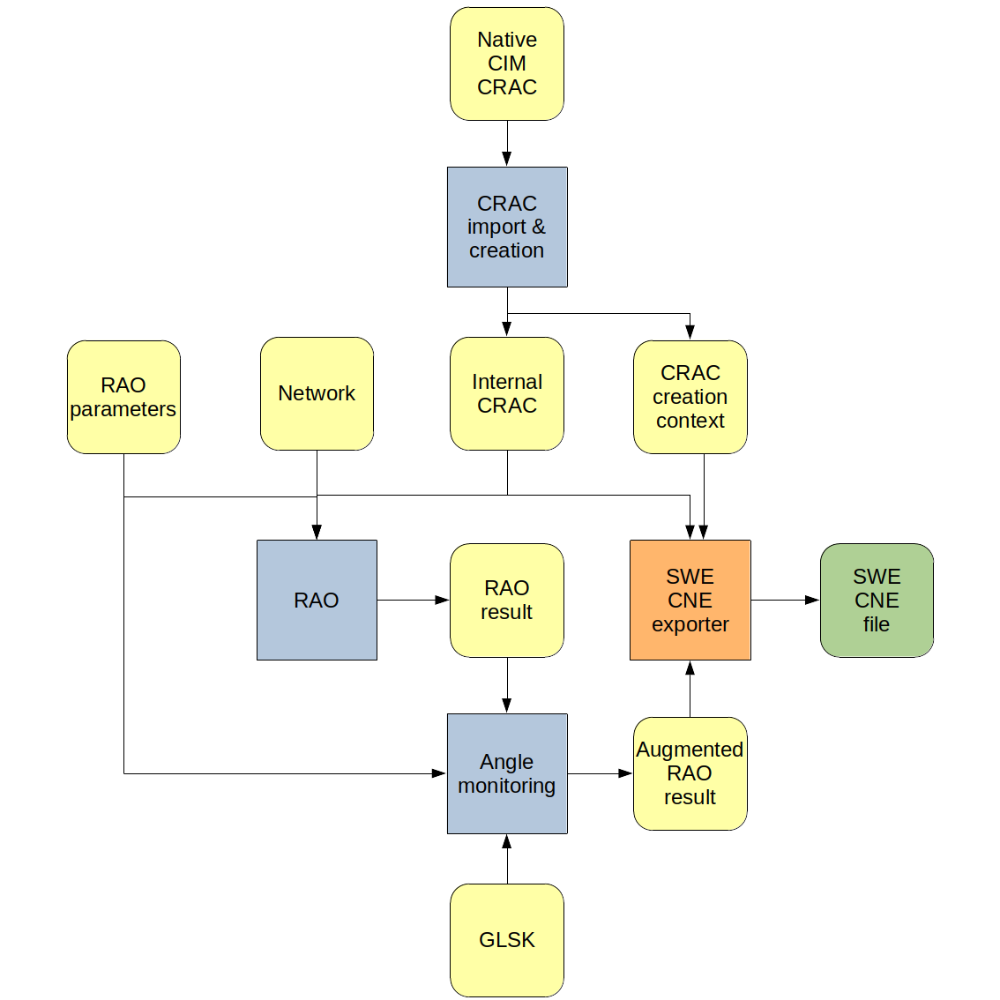
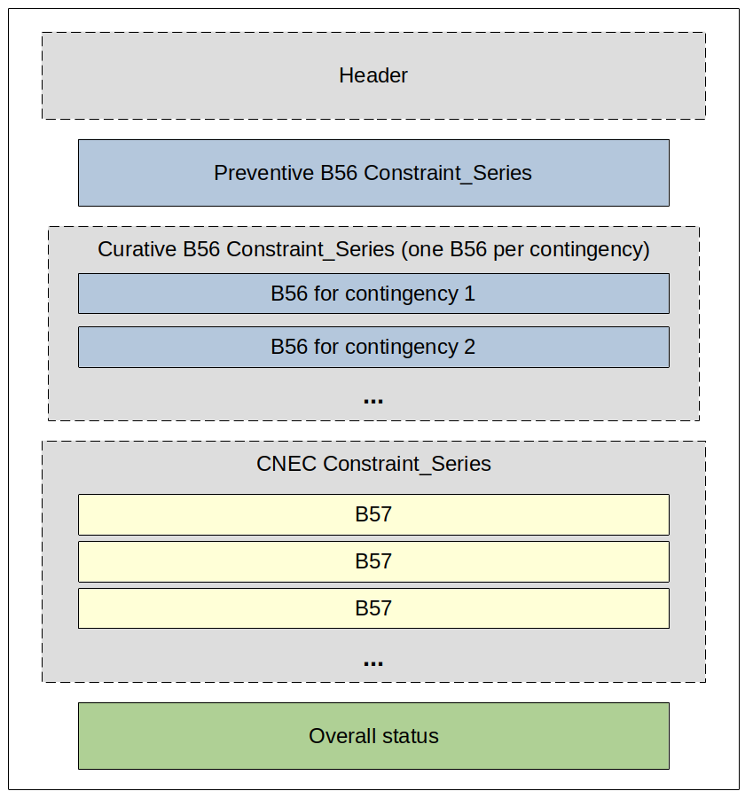

# SWE CNE File

## Introduction

The SWE CNE file is the standard RAO output file for the SWE CC process.  
The [OpenRAO toolbox](https://github.com/powsybl/powsybl-open-rao/blob/main/data/rao-result/rao-result-io/rao-result-cne/swe-cne-exporter/src/main/java/com/powsybl/openrao/data/raoresult/io/cne/swe/SweCneExporter.java)
allows exporting [RAO results](rao-result.md) (containing [angle results](../algorithms/monitoring.md#the-monitoring-result) if the CRAC contains [Angle CNECs](../input-data/crac/json.md#angle-cnecs))
in a SWE CNE file using a [CimCracCreationContext](../input-data/crac/creation-context.md#cim-implementation), and specific properties.

{.forced-white-background}

## Java API

After completing the RAO, the user can export the [`RaoResult`](rao-result.md) object as a SWE CNE file using the `write` method with the `"SWE-CNE""` format:

~~~java
// RaoResult interface
public void write(String format, CracCreationContext cracCreationContext, Properties properties, OutputStream outputStream)
~~~

With:
- **raoResult**: the [RaoResult](rao-result.md) object containing selected remedial actions and flow
  results, as well as [angle results](../algorithms/monitoring.md) if the CRAC contains [Angle CNECs](../input-data/crac/json.md#angle-cnecs)
- **cracCreationContext**: the [CimCracCreationContext object](../input-data/crac/creation-context.md#cim-implementation) generated during
  [CRAC creation](../input-data/crac/import.md) from a native [CIM CRAC file](../input-data/crac/cim.md).
  > ⚠️  **NOTE**  
  > The exporter will fail if angle CNECs are present in the CRAC, but the RAO result does not contain angle results.  
  > See how to compute angle results [here](../algorithms/monitoring.md#the-monitoring-algorithm).
- **properties**: a specific object that te user should define, containing meta-information that will be written
  in the header of the CNE file as well as relevant RAO parameters:
    - **`"document-id"`**: document ID to be written in "mRID" field
    - **`"revision-number"`**: integer to be written in "revisionNumber" field
    - **`"domain-id"`**: domain ID to be written in "domain.mRID" field (usually an [ENTSO-E EICode](https://www.entsoe.eu/data/energy-identification-codes-eic/))
    - **`"process-type"`**: the ENTSO-E code of the process type, to be written in "process.processType" field:
        - ~~**A48**~~: Day-ahead capacity determination, used for CORE region (so don't use it here)
        - **Z01**: Day-ahead capacity determination, used for SWE region
    - **`"sender-id"`**: ID of the sender of the CNE document, to be written in "sender_MarketParticipant.mRID" field
      (usually an [ENTSO-E EICode](https://www.entsoe.eu/data/energy-identification-codes-eic/))
    - **`"sender-role"`**: ENTSO-E code defining the role of the sender of the CNE document, to be written in
      "sender_MarketParticipant.marketRole.type" field:
        - **A04**: system operator
        - **A36**: capacity coordinator
        - **A44**: regional security coordinator
    - **`"receiver-id"`**: ID of the receiver of the CNE document, to be written in "receiver_MarketParticipant.mRID" field
      (usually an [ENTSO-E EICode](https://www.entsoe.eu/data/energy-identification-codes-eic/))
    - **`"receiver-role"`**: ENTSO-E code defining the role of the receiver of the CNE document, to be written in
      "receiver_MarketParticipant.marketRole.type" field. Same value options as senderRole.
    - **`"time-interval"`**: time interval of document applicability, to be written in "time_Period.timeInterval" field. It should
      be formatted as follows: "YYYY-MM-DDTHH:MMZ/YYYY-MM-DDTHH:MMZ" (start date / end date).
    - **`"objective-function-type"`** (optional, default is `"max-min-relative-margin-in-megawatt"`, should match the input RaoParameters)
    - **`"with-loop-flows"`** (optional, default is `"false"`, should match the input RaoParameters)
    - **`"mnec-acceptable-margin-diminution"`** (optional, default is `"0"`, should match the input RaoParameters)

Here is a complete example:

~~~java
// Fetch input data (network) and parameters
Network network = ...
RaoParameters raoParameters = ...
// Create CRAC
CracCreationContext cracCreationContext = CracCreators.createCrac(...);
Crac crac = cracCreationContext.getCrac();
// Run RAO
RaoResult raoResult = Rao.find(...).run(...)
// Set SWE-CNE export properties
Properties properties = new Properties();
properties.setProperty("rao-result.export.swe-cne.document-id", "DOCUMENT_ID");
properties.setProperty("rao-result.export.swe-cne.revision-number", "1");
properties.setProperty("rao-result.export.swe-cne.domain-id", "DOMAIN_ID");
properties.setProperty("rao-result.export.swe-cne.process-type", "Z01");
properties.setProperty("rao-result.export.swe-cne.sender-id", "SENDER_ID");
properties.setProperty("rao-result.export.swe-cne.sender-role", "A44"); // REGIONAL_SECURITY_COORDINATOR
properties.setProperty("rao-result.export.swe-cne.receiver-id", "RECEIVER_ID");
properties.setProperty("rao-result.export.swe-cne.receiver-role", "A36"); // CAPACITY_COORDINATOR
properties.setProperty("rao-result.export.swe-cne.time-interval", "2021-10-30T22:00Z/2021-10-31T23:00Z");
// Export CNE to output stream
OutputStream os = ...
raoResult.write("SWE-CNE", cracCreationContext, properties, os);
~~~

## Contents of the SWE CNE file

Here is an overview of the general structure of the SWE CNE document, detailed in the following sections:

### Header

The header contains meta-information about the process.  
Refer to the [JAVA API](#java-api) section for more details.

Example:

~~~xml
<?xml version="1.0" encoding="UTF-8" standalone="yes"?>
<CriticalNetworkElement_MarketDocument xsi:schemaLocation="iec62325-451-n-cne_v2_3.xsd" xmlns="urn:iec62325.351:tc57wg16:451-n:cnedocument:2:3" xmlns:xsi="http://www.w3.org/2001/XMLSchema-instance">
    <mRID>documentId</mRID>
    <revisionNumber>3</revisionNumber>
    <type>B06</type>
    <process.processType>A48</process.processType>
    <sender_MarketParticipant.mRID codingScheme="A01">senderId</sender_MarketParticipant.mRID>
    <sender_MarketParticipant.marketRole.type>A44</sender_MarketParticipant.marketRole.type>
    <receiver_MarketParticipant.mRID codingScheme="A01">receiverId</receiver_MarketParticipant.mRID>
    <receiver_MarketParticipant.marketRole.type>A36</receiver_MarketParticipant.marketRole.type>
    <createdDateTime>2022-09-28T14:47:09Z</createdDateTime>
    <time_Period.timeInterval>
        <start>2021-04-02T00:30Z</start>
        <end>2021-04-02T01:30Z</end>
    </time_Period.timeInterval>
    <TimeSeries>
        <mRID>CNE_RAO_CASTOR-TimeSeries-1</mRID>
        <businessType>B54</businessType>
        <curveType>A01</curveType>
        <Period>
            <timeInterval>
                <start>2021-04-02T03:00Z</start>
                <end>2021-04-02T04:00Z</end>
            </timeInterval>
            <resolution>PT60M</resolution>
            <Point>
                <position>1</position>
...
~~~

### Remedial action results

Remedial actions have their own Constraint_Series to report the ones selected by the RAO **or by the
[monitoring module](../algorithms/monitoring.md)** while using **ANGLE** as Physical parameter.     
The remedial actions' Constraint_Series all have a **B56 businessType**.

Example:

~~~xml
<Constraint_Series>
  <mRID>542c55e-ac23-49a9-b26f-097081883e7f</mRID>
  <businessType>B56</businessType>
  <Contingency_Series>
    <mRID>Co-1</mRID>
    <name>contingency one</name>
  </Contingency_Series>
  <RemedialAction_Series>
    <mRID>RA-19</mRID>
    <name>topological remedial action 19</name>
    <applicationMode_MarketObjectStatus.status>A20</applicationMode_MarketObjectStatus.status>
  </RemedialAction_Series>
  <RemedialAction_Series>
    <mRID>RA-192@600@</mRID>
    <name>HVDC remedial action@600@</name>
    <applicationMode_MarketObjectStatus.status>A20</applicationMode_MarketObjectStatus.status>
  </RemedialAction_Series>
  <RemedialAction_Series>
    <mRID>RA-45</mRID>
    <name>PST remedial action 45</name>
    <applicationMode_MarketObjectStatus.status>A20</applicationMode_MarketObjectStatus.status>
    <RegisteredResource>
      <mRID codingScheme="A01">pst_in_network@-5@</mRID>
      <name>PST remedial action 45</name>
      <pSRType.psrType>A06</pSRType.psrType>
      <marketObjectStatus.status>A26</marketObjectStatus.status>
      <resourceCapacity.defaultCapacity>-5</resourceCapacity.defaultCapacity>
      <resourceCapacity.unitSymbol>C62</resourceCapacity.unitSymbol>
      <marketObjectStatus.status>A26</marketObjectStatus.status>
    </RegisteredResource>
  </RemedialAction_Series>
...
~~~

#### mRID

Random ID, unique in the CNE document.

#### businessType

Always **B56**, to signify that this is a remedial-action Constraint_Series.

#### Contingency_Series (optional)

If this tag exists, then this Constraint_Series reports selected **automatic** or **curative** remedial actions by
the RAO or by the angle monitoring module, after the contingency defined in this tag:
- **mRID**: unique ID of the contingency as it is defined in the native CRAC
- **name**: name of the contingency as it is defined in the native CRAC

#### RemedialAction_Series

##### mRID

Unique ID of the selected remedial action, as identified in the original CRAC.
> 💡  **NOTE**  
> If it is an HVDC range action, this field is followed by @setpoint@, where "setpoint" is the optimal set-point
> selected for the HVDC, in megawatts (see example above)

##### name

Name of the selected remedial action, as identified in the original CRAC.
> 💡  **NOTE**  
> If it is an HVDC range action, this field is followed by @setpoint@, where "setpoint" is the optimal set-point
> selected for the HVDC, in megawatts (see example above)

##### applicationMode_MarketObjectStatus.status

This tag can have one of these three values:
- **A18**: the remedial action was selected in preventive
- **A20**: the remedial action was selected as automatic
- **A19**: the remedial action was selected in curative

##### RegisteredResource (optional)

This tag is only exported for **PST remedial actions**, to hold their tap values.

##### mRID

Unique ID of the remedial action's PST network element in the network, followed by "@tap@", where tap is its optimal
tap selected by the RAO or by the angle monitoring module.

##### name

Name of the selected remedial action, as identified in the original CRAC.

##### pSRType.psrType

Only one possible value for now:
- **A06**: remedial action is a PST

##### resourceCapacity.defaultCapacity

Optimal tap position for the PST (at instant identified by **applicationMode_MarketObjectStatus.status**, eventually after
contingency identified by **Contingency_Series**).

##### resourceCapacity.unitSymbol

Unit of the tap given in **resourceCapacity.defaultCapacity**. Only one supported value for now:
- **C62**: dimensionless

##### marketObjectStatus.status

Only one supported value for now:
- **A26**: the tap is given in absolute value (not relatively to initial network, nor to previous instant, ...)

### CNEC results

CNEC results after RAO are reported in **Constraint_Series** tags, with **businessType** value **B57**.

Example:

~~~xml
<Constraint_Series>
  <mRID>0cb4110-02cf-4516-943e-7f717bc1c2b8</mRID>
  <businessType>B57</businessType>
  <Contingency_Series>
    <mRID>Co-175</mRID>
    <name>contingency 175</name>
  </Contingency_Series>
  <AdditionalConstraint_Series>
    <mRID>REN-AC-2</mRID>
    <businessType>B87</businessType>
    <name>Angle-ALTO-LINDOSO-CARTELLE-EXPORT</name>
    <quantity.quantity>-39.8</quantity.quantity>
  </AdditionalConstraint_Series>
  <Monitored_Series>
    <mRID>MS-1</mRID>
    <name>Branch Paris-Berlin monitored in curative</name>
    <RegisteredResource>
      <mRID codingScheme="A02">_68c74a71-224a-245f-0b52-eac5045761eb</mRID>
      <name>Branch Paris-Berlin</name>
      <in_AggregateNode.mRID codingScheme="A02">_7fb8ba77-76a2-7343-b1f9-10d8fb9bdae1</in_AggregateNode.mRID>
      <out_AggregateNode.mRID codingScheme="A02">_d5c2a18c-ef2d-10ae-4419-c832c53860b1</out_AggregateNode.mRID>
      <Measurements>
        <measurementType>A01</measurementType>
        <unitSymbol>AMP</unitSymbol>
        <positiveFlowIn>A02</positiveFlowIn>
        <analogValues.value>270</analogValues.value>
      </Measurements>
      <Measurements>
        <measurementType>A13</measurementType>
        <unitSymbol>AMP</unitSymbol>
        <positiveFlowIn>A02</positiveFlowIn>
        <analogValues.value>2606</analogValues.value>
      </Measurements>
    </RegisteredResource>
  </Monitored_Series>
  <Monitored_Series>
    <mRID>MS-2</mRID>
    <name>Branch Paris-Brussels monitored in curative</name>
...
~~~

#### mRID

Random ID, unique in the CNE document.

#### businessType

One possible value to signify it's a CNEC result: **B57**.

#### Contingency_Series (optional)

Exists if the CNEC is monitored after a contingency (if the CNEC is preventive, this tag does not exist):
- **mRID**: unique ID of the contingency as it is defined in the native CRAC
- **name**: name of the contingency as it is defined in the native CRAC
> ⚠️  **NOTE**  
> Multiple Contingency_Series can exist, meaning that the following results are valid for all the listed contingencies.
> Avoiding redundant information allows a more compact file.

#### Reason (optional)

When sensitivity computation fails in a given perimeter (in basecase or after a specific contingency identified by
**Contingency_Series**), this tag is present with the following information:
- **code**: "B40"
- **text**: "Load flow divergence"

Then no more results are exported for the failed perimeter.

#### AdditionalConstraint_Series (optional)

If angle CNECs are monitored in the actual perimeter (in basecase or after a specific contingency identified by
**Contingency_Series**), this tag contains angle values from the angle monitoring module.

##### mRID

Unique ID of the angle CNEC, as defined in the [orignal CRAC file](../input-data/crac/cim.md#anglecnecs).

##### businessType

One possible value: **B87** (angle monitoring).

##### name

Name of the angle CNEC, as defined in the [orignal CRAC file](../input-data/crac/cim.md#anglecnecs).

##### quantity.quantity

Phase shift angle value of the CNEC, expressed in degrees.

#### Monitored_Series

##### mRID

Unique ID of the CNEC as defined in the native CRAC file.

##### name

Name of the CNEC as defined in the native CRAC file.

#### RegisteredResource

##### mRID

Unique ID of the CNEC's network element, as defined in the native CRAC file and in the network.

##### name

The name of the CNEC as defined in the native CRAC file.

##### in_AggregateNode.mRID

Unique ID, in the network, of the voltage level on the branch's left side.

##### out_AggregateNode.mRID

Unique ID, in the network, of the voltage level on the branch's right side.

##### PTDF_Domain (optional)

Only in the hypothetical case of a [relative margins objective function](../parameters/business-parameters.md#type).
- **mRID**: [ENTSO-E EICode](https://www.entsoe.eu/data/energy-identification-codes-eic/) of the area
- **pTDF_Quantity.quantity**: value of the PTDF associated to the bidding zone for the critical network element
> ⚠️  **NOTE**  
> This tag is currently not supported in OpenRAO, since the SWE CC process (only process to use the SWE CNE format)
> does not optimise relative margins

##### Measurements
- measurementType: type of measurement, possible values are:
    - **A01**: flow
    - **A02**: PATL in the preventive state (input data)
    - **A07**: TATL right after outage (input data)
    - **A12**: TATL at auto instant (input data)
    - **A13**: PATL in curative (input data)
- unitSymbol: unit of measurement. Only supported value is **AMP** (ampere)
- positiveFlowIn: sign of the value, possible values are:
    - **A01**: measurement is positive (its actual value is analogValues.value)
    - **A02**: measurement is negative (its actual value is -analogValues.value)
- analogValues.value: absolute value of the measurement

Depending on whether the Constraint_Series is preventive, some or all of these measurements are expected:

| Measurement type | Measurement       | Unit(s) | Exported in preventive B57 | Exported in non-preventive B57 |
|------------------|-------------------|---------|----------------------------|--------------------------------|
| **A01**          | Flow              | AMP     | ✔️                         | ✔️                             |
| **A02**          | PATL (preventive) | AMP     | ✔️                         |                                |
| **A07**          | TATL (outage)     | AMP     | ️                          | at least one                   |
| **A12**          | TATL (auto)       | AMP     | ️                          | of these three                 |
| **A13**          | PATL (curative)   | AMP     | ️                          | measurements️                  |

#### RemedialAction_Series (optional)

This tag is used to report remedial actions that were selected by the RAO for the CNEC's state.

##### mRID

Unique ID of the selected remedial action, as identified in the original CRAC.

##### name

Name of the selected remedial action, as identified in the original CRAC.

##### applicationMode_MarketObjectStatus.status

Three possible values:
- **A18**: the remedial action was selected in preventive
- **A20**: the remedial action was selected as an automaton
- **A19**: the remedial action was selected in curative

### Overall status

The overall status of the RAO computation is exported in a **Reason** tag.
Here are the possible out-comes.

#### Secure network

~~~xml
<Reason>
    <code>Z13</code>
    <text>Network is secure</text>
</Reason>
~~~
This means that the RAO completed successfully and that the network is secure (i.e. no flow nor angle constraints remain).

#### Unsecure network

~~~xml
<Reason>
    <code>Z03</code>
    <text>Network is unsecure</text>
</Reason>
~~~
This means that the RAO completed successfully but that the network is unsecure (i.e. there remains at least one flow or
one angle constraints).

#### Load-flow divergence

~~~xml
<Reason>
    <code>B40</code>
    <text>Load flow divergence</text>
</Reason>
~~~
This means that the RAO or the angle monitoring could not be conducted normally because at least one perimeter lead to
a load-flow divergence. This perimeter can be identified by looking at the [B57 Constraint_Series](#cnec-results).